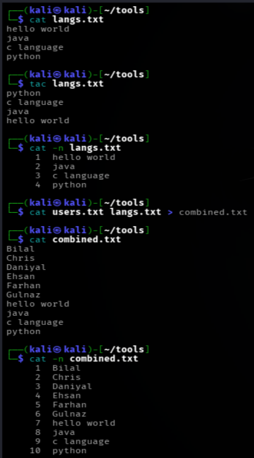
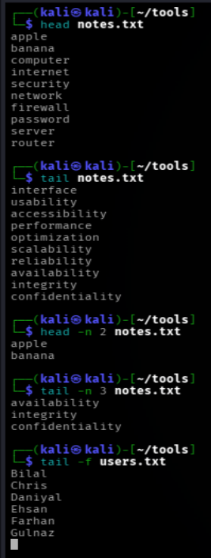
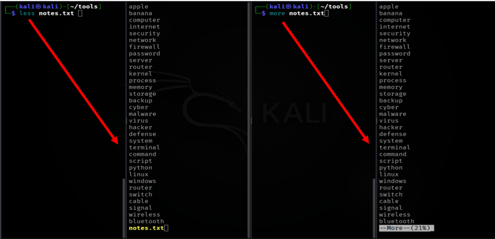
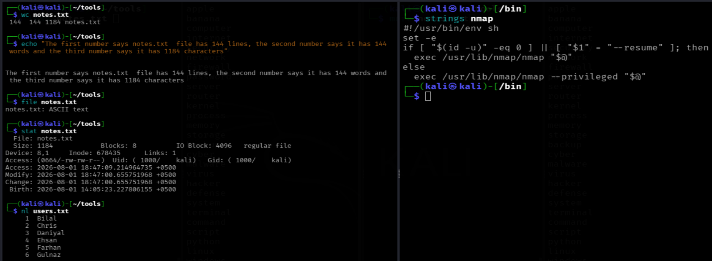

# LINUX FILE READING COMMANDS DOCUMENTATION
*Maintained by Muhammad Awais*

## cat (concatenate)
Basically, this command prints the entire content of a file straight to the screen, all at once, from top to bottom.

`cat notes.txt`
It works well for small files where everything fits on one screen. For big files, it just dumps everything at once, which can scroll past too fast to actually read.

Useful extra flags:

| Command | What it does |
|---|---|
| `cat file1 file2` | Prints both files one after another, joined together |
| `cat -n file.txt` | Adds line numbers to every line while printing |
| `cat file1 file2 > combined.txt` | Joins two files into a new file instead of printing to screen |

## tac
In simple words, this is `cat` spelled backwards, and it does the opposite of `cat`. It prints the file content starting from the last line and working up to the first line.

`tac notes.txt`
Quick take: useful when you want to read a log file from the most recent entry backward, since most logs add new lines at the bottom.

## head
In short, this shows only the beginning of a file, not the whole thing. By default it shows the first ten lines.
`head notes.txt`

To control how many lines it shows:
`head -n 5 notes.txt`
This would show only the first five lines instead of the default ten.

## tail
Basically the opposite of `head`. It shows the end of a file instead of the beginning, ten lines by default.
`tail notes.txt`

To control the number of lines:
`tail -n 5 notes.txt`

There is also a very useful live mode:
`tail -f logfile.txt`
This keeps the file open and shows new lines as they get added in real time, which is extremely useful for watching a log file while a program is actively writing to it.

## more
This command shows a file one screen at a time instead of dumping everything at once, which is helpful for long files.

`more notes.txt`
You move forward by pressing space, and press q to quit. The one limitation with `more` is that it can only move forward through the file, not backward.

## less
This is basically an improved version of `more`. It also shows the file one screen at a time, but it lets you scroll both forward and backward freely, and it feels much smoother to use.

`less notes.txt`
Inside `less`, the arrow keys let you move up and down, and pressing **q** quits and returns you to the terminal. A common saying among Linux users is that less does more than more, which is a small joke about this exact difference.

## A Few Other File Reading Commands Worth Knowing

### wc (word count)
It counts lines, words, and characters in a file.
`wc notes.txt`
The output shows three numbers in order, lines, words, then characters, followed by the filename.

### nl (number line)
Similar to cat, but it automatically adds line numbers to every line of the output.
`nl notes.txt`

### file
This does not actually read the content of a file, instead it tells you what type of file it is, like text, image, executable, or something else.
`file notes.txt`

### stat
Shows detailed metadata about a file, things like size, permissions, and the exact time it was last modified or accessed, rather than the actual content inside it.
`stat notes.txt`

### strings
Useful for binary or non text files. It pulls out only the readable, human friendly text hidden inside a file that is otherwise not meant to be opened directly.
`strings file.bin`

## Commands discussed in this  file for "file reading"

| Command | Variants used |
|---|---|
| `cat` | `cat file1 file2`, `cat -n file.txt`, `cat file1 file2 > combined.txt` |
| `tac` | `tac notes.txt` |
| `head` | `head notes.txt`, `head -n 5 notes.txt` |
| `tail` | `tail notes.txt`, `tail -n 5 notes.txt`, `tail -f logfile.txt` |
| `more` | `more notes.txt` |
| `less` | `less notes.txt` |
| `wc` | `wc notes.txt` |
| `nl` | `nl notes.txt` |
| `file` | `file notes.txt` |
| `stat` | `stat notes.txt` |
| `strings` | `strings somefile.bin` |

