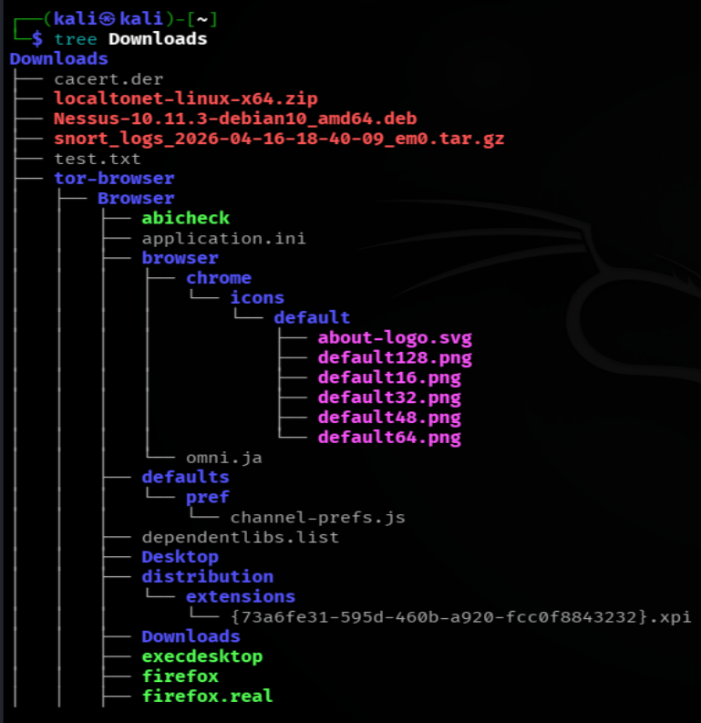
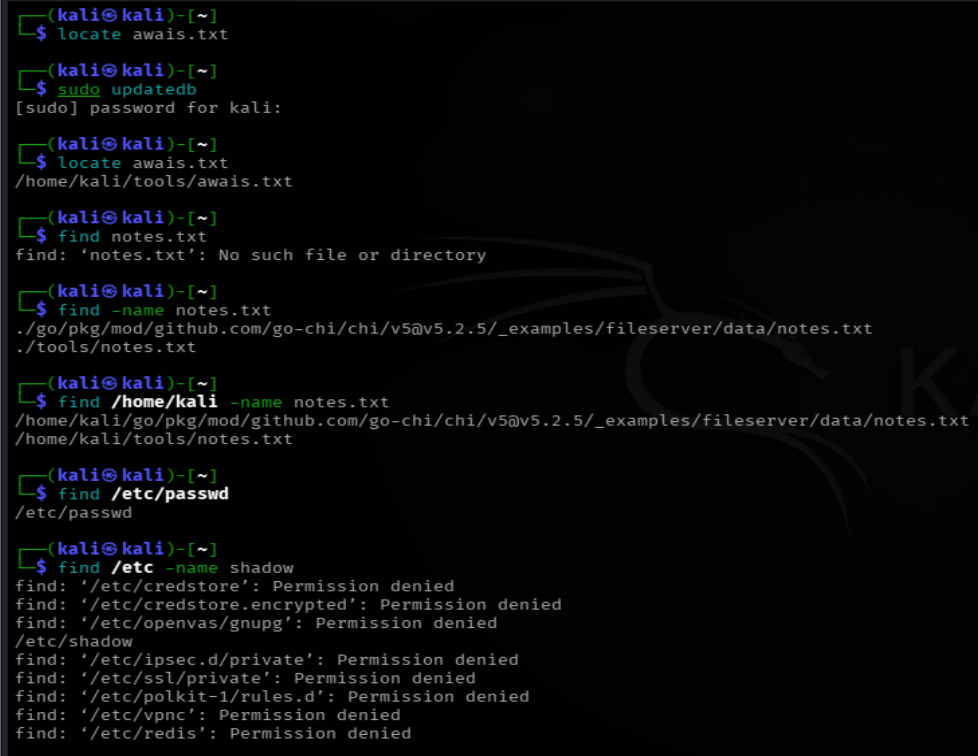
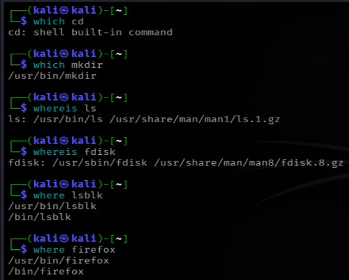

# LINUX NAVIGATION COMMANDS DOCUMENTATION 
*Maintained by Muhammad Awais*

## pwd (print working directory)
Prints the current working directory, tells you exactly where you are in the filesystem right now.

### Example:
pwd
/home/kali

## ls (list) and its variants
Lists the files and directories inside the current directory.

### Difference between its variants
| Command | What it does |
|---|---|
| `ls` | Simple list, just names |
| `ls -l` | Long format, shows permissions, owner, size, and date |
| `ls -a` | Also shows hidden files, the ones that start with a dot |
| `ls -al` / `ls -la` | Both are the same thing, long format plus hidden files together. Flag order does not matter, `-al` and `-la` give the exact same result |
| `ls -li` | Long format plus the inode number of each file, which is its unique internal ID on disk | 
| `ls -R` | list recursively (includes sub-directories) | 

### Note: 
flags can be combined in any order, `ls -al` equals `ls -la` equals `ls -a -l`, all give the same output.

## cd (change directory) and its variants
Changes your current directory.

### Difference between its variants
| Command | What it does |
|---|---|
| `cd <dirname>` | Moves into that named directory, if it exists inside the current one |
| `cd ..` | Moves one level up, into the parent directory |
| `cd -` | Jumps back to the previous directory you were just in |
| `cd` (no argument) | Takes you straight to your home directory | 

## tree
Shows the directory structure as a visual tree, with all nested folders and files at every level laid out clearly.

## find vs locate, the real difference
These two commands confuse a lot of people, but the difference is actually simple once you see it clearly.

`find` searches the filesystem live, in real time. Every time you run it, it walks through the actual disk right then and there. This can be a bit slow on large systems, but the result is always accurate and completely up to date.

`locate` searches a pre built database(**mlocate.db**) instead of the live disk. This database gets refreshed periodically, either automatically through a scheduled job or manually with a command. Because of this, `locate` is extremely fast since it never touches the real filesystem during the search. But there is a catch, if a file was just created and the database has not been refreshed yet, `locate` simply will not know it exists.

## A General Scenario To Understand This Clearly
Imagine you just created a new file somewhere on your system, let us call it `notes.txt`, sitting inside some folder you made a few seconds ago.

You run:
`locate notes.txt`

Nothing shows up. This is not a bug. It just means the `locate` database has not caught up yet with this new file. The database only refreshes on its own schedule (or when someone manually runs `updatedb`), so anything created after the last refresh is visible to `locate` until the next update.

Fix:
`sudo updatedb`
Run this once, and now `locate notes.txt` will find it right away, because the database has been refreshed.

Now try:
`find notes.txt`
This gives an error like "No such file or directory". This trips people up a lot, but here is why it happens. The correct way `find` expects to be used is:

find <path to search in> <search criteria>

When you type just `find notes.txt`, the command interprets `notes.txt` as the *path* you want it to search inside, meaning it thinks you are asking it to look inside a directory called `notes.txt`. Since no such directory exists, it throws an error. It was never told to search *for* a file by that name, it thought you were telling it *where* to search.

Now try the correct way:

`find -name notes.txt`
This works and shows the full path. Adding `-name` tells `find` clearly that you want it to search *for* a file matching that name, and since no starting path was given, it defaults to searching the current directory and everything inside it.

Easy tip: always pair `find` with `-name` (or another matching option) when you are searching by filename. Typing just `find filename` on its own is a common mistake and will almost always give you an error instead of a result.

## find <path> vs find <path> -name <pattern>

`find /etc/passwd`
This checks one exact, specific path directly, basically asking "does this exact file exist at this exact location". If it does, the path gets printed back.

`find /etc -name passwd`
This searches inside `/etc` and every subdirectory beneath it, looking for anything named "passwd". This is a pattern based search, not a single exact path check.

`find / -name <example>`
This searches the entire filesystem starting from root. It is the widest and slowest possible search, but also the most thorough, since nothing on the system gets skipped.

## which
Tells you exactly where the executable binary for a command lives, by searching through the directories listed in your `$PATH`.

`which nmap`
/usr/bin/nmap

`which cd`
(nothing shown, because cd is a shell builtin, not a separate binary file)

### Note: 
`which` only works for commands that exist as actual binary files somewhere in `$PATH`. Some commands like `cd` are built directly into the shell itself rather than existing as separate programs, so `which` cannot locate them.

## whereis
Goes further than `which`, it looks for the binary, the source code, and the manual page all at once.

`whereis ls`
ls: /usr/bin/ls /usr/share/man/man1/ls.1.gz

So while `which` only gives you the binary path, `whereis` gives you the binary plus its documentation, all in one shot.

## where
Lists every location on the system where a command exists, not just the one that would actually run.

Kali Linux has used zsh as its default shell since around 2020, not bash, and `where` happens to be a builtin in zsh. That is why on a stock Kali terminal, `where firefox` works perfectly fine and prints the path straight away.

You can confirm which shell you are actually running with:
`echo $SHELL`

If that prints `/usr/bin/zsh`, you are on zsh, which is exactly why `where` works for you out of the box.

The real distinction between `where` and `which` is this: if there is only one copy of a command anywhere on the system, both will basically show you the same single path. The difference only becomes visible when a command exists in more than one location, in that case `which` shows you just the one that will actually run, while `where` lists every single copy it can find.

If someone is working purely in bash, or writing a bash script, `where` will not exist there and will return "command not found", since it is not a bash builtin.

## which vs whereis vs where, quick comparison
| Command | What it gives you | When to use it |
|---|---|---|
| `which` | Just the one executable path that would actually run, found through `$PATH` | When you only need to know where a command is running from |
| `whereis` | Binary, source, and manual page together | When you need more detail, including documentation |
| `where` | Every location where the command exists, works in zsh (Kali's default shell), not available in plain bash | When you want to check if a command exists in more than one place |

## Commands discussed in this file for "navigation"

| Command | Variants used |
|---|---|
| `pwd` | `pwd` |
| `ls` | `ls`, `ls -l`, `ls -a`, `ls -al` / `ls -la`, `ls -li` |
| `cd` | `cd <dirname>`, `cd ..`, `cd -`, `cd` |
| `tree` | `tree Desktop` |
| `find` | `find /etc/passwd`, `find /etc -name passwd`, `find / -name <example>`, `find -name notes.txt` |
| `locate` | `locate notes.txt` |
| `updatedb` | `sudo updatedb` |
| `which` | `which nmap`, `which cd` |
| `whereis` | `whereis ls` |
| `where` | `where firefox` |

