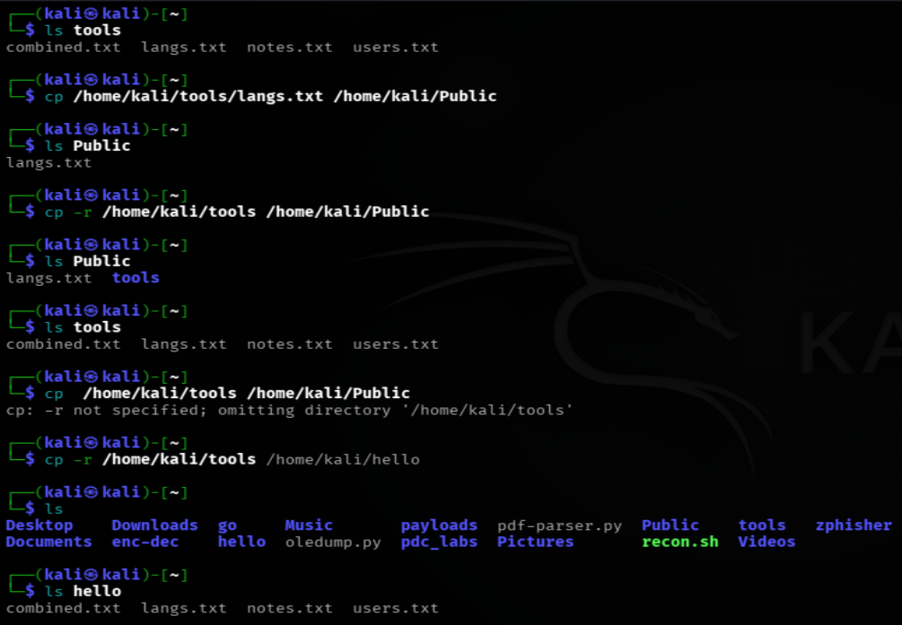
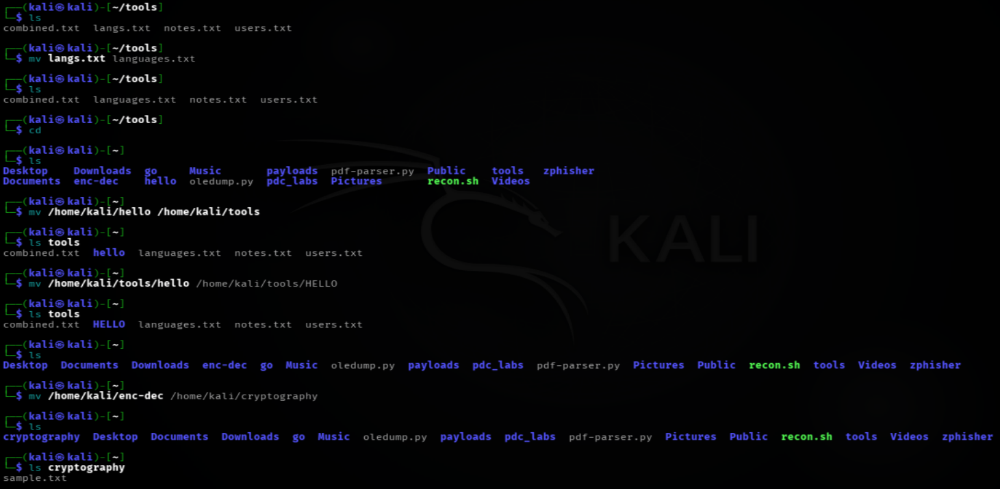
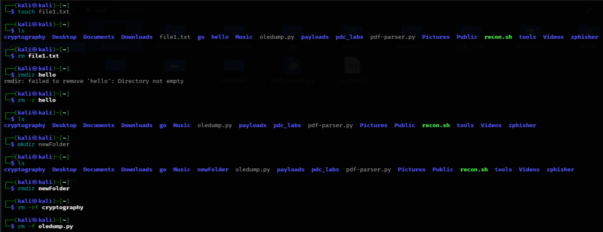
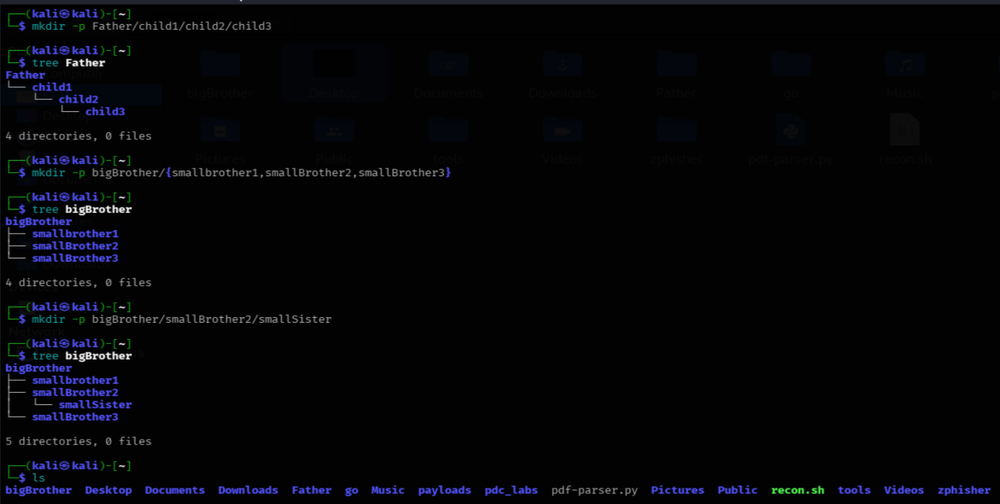

# LINUX FILE OPERATIONS COMMANDS DOCUMENTATION
*Maintained by Muhammad Awais*

## cp (copy)
Basically, this command copies a file from one place to another, leaving the original file exactly where it was.
Usage:
cp <source> <destination>

Example:
`cp notes.txt backup.txt`
This creates a new file called `backup.txt` with the same content as `notes.txt`, while `notes.txt` itself stays untouched.

## cp -r
In short, plain `cp` only works on single files, it cannot copy a whole folder on its own. Adding `-r` (which stands for recursive) tells `cp` to go inside the folder and copy everything within it, including any subfolders.

Usage:
cp -r <source> <destination>

## Two Different Scenarios with `cp -r`, Two Different Results

### Case 1: Destination Directory Already Exists

`cp -r /home/kali/tools /home/kali/Public`
Since `Public` already existed, `cp -r` took the whole `tools` directory and copied it inside `Public`, keeping its own name along with it. 
Result:
`/home/kali/Public/tools/`   ← the tools directory itself, with its files, sitting inside Public
If the destination already exists, the source directory goes inside it as a subdirectory, keeping its original name.

### Case 2: Destination Directory Did Not Exist

`cp -r /home/kali/tools /home/kali/hello`
Since a directory named `hello` did not exist yet, `cp` treated that name as "create a new directory with this exact name". 
Result:
`/home/kali/hello/`   ← this `hello` itself becomes the copy of tools, but renamed to hello (all the files from tools land directly inside it)
If the destination does not exist, `cp -r` creates a new directory with that name and drops the source's content straight into it, essentially renaming the directory during the copy.

### Easy Comparison for these scenarios

| State of destination | What happens |
|---|---|
| Already exists (a directory) | Source goes inside it as a nested subdirectory, keeping its original name |
| Does not exist | Destination itself becomes a new directory, source's content lands directly inside it, the source's original name is lost |

## mv (move, rename a file/folder)
This command moves a file or folder from one location to another. It also doubles as the rename command in Linux, since renaming is really just moving a file to a new name in the same place.

Usage:
mv <source> <destination>

Example (moving a file):
`mv notes.txt tools/notes.txt` ← it will move the notes.txt inside the tools directory

Example (renaming a file):
`mv oldname.txt newname.txt`  ← it will rename an existing file into a newname given by us.

## rm (remove)
This deletes a file. Unlike moving something to a recycle bin, this is permanent, there is no built in undo.

Example:
`rm oldfile.txt`

## rm -r (remove directories recursively)
Plain `rm` only deletes files, not folders. Adding `-r` makes it recursive, so it goes inside a folder and deletes everything in it, then deletes the folder itself.

Example:
`rm -r Day-2-backup`

## rm -rf
This combines two flags together, `-r` for recursive (folders and their contents) and `-f` for force, which skips any confirmation prompts and ignores warnings about files that may not exist.

Example:
`rm -rf test-folder`
This is one of the most dangerous commands in Linux if typed carelessly, since it deletes everything instantly with no confirmation and no way to recover it afterward. Always double check the path before running this.

## rm -f
Just the force flag on its own, without recursive. This deletes a single file without asking for confirmation, and it will not throw an error even if the file does not actually exist.

Example:
`rm -f maybe-missing.txt`

## mkdir (make directory)
This creates a new, empty folder.

Example:
`mkdir Day-3`

## mkdir -p

The `-p` flag stands for parents. This is useful when you want to create a folder that is nested inside other folders that do not exist yet, since normal `mkdir` would fail if the parent folders are missing.

Example:
`mkdir -p Day-3/notes/drafts`
This creates `Day-3`, then `notes` inside it, then `drafts` inside that, all in one go, even though none of them existed before.

## mkdir -p{}
This combines `-p` with brace expansion, letting you create several sibling folders inside the same parent folder in a single command

Example:
`mkdir -p Day-3/{images,notes,screenshots}`
This creates `Day-3` if it does not already exist, and then creates `images`, `notes`, and `screenshots` all inside it at once, instead of running `mkdir` three separate times.

## rmdir (remove directory)
This deletes a folder, but only if it is completely empty. If there is anything inside it, `rmdir` will refuse and show an error instead of deleting it.

Example:
`rmdir empty-folder`
For folders that still have files inside them, `rm -r` is used instead, not `rmdir`.

## touch
This creates a new, empty file. It is also commonly used to update the last modified timestamp of a file that already exists, without changing its content at all.

Example:
`touch newfile.txt`

## Commands discussed in this file for "file operations"

| Command | Variants used |
|---|---|
| `cp` | `cp <source> <destination>` |
| `cp -r` | `cp -r <source folder> <destination>` |
| `mv` | `mv <source> <destination>` |
| `rm` | `rm <filename>` |
| `rm -r` | `rm -r <foldername>` |
| `rm -rf` | `rm -rf <foldername>` |
| `rm -f` | `rm -f <filename>` |
| `mkdir` | `mkdir <foldername>` |
| `mkdir -p` | `mkdir -p <path>` |
| `mkdir -p{}` | `mkdir -p parent/{folder1,folder2,folder3}` |
| `rmdir` | `rmdir <foldername>` |
| `touch` | `touch <filename>` |