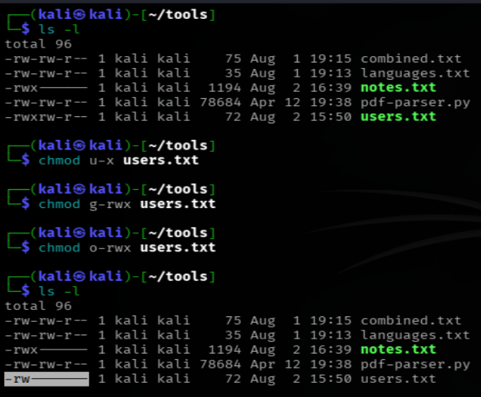
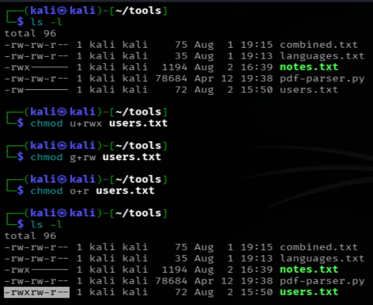
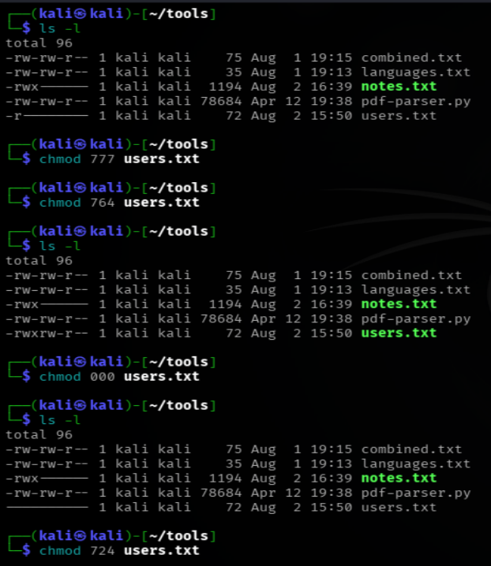
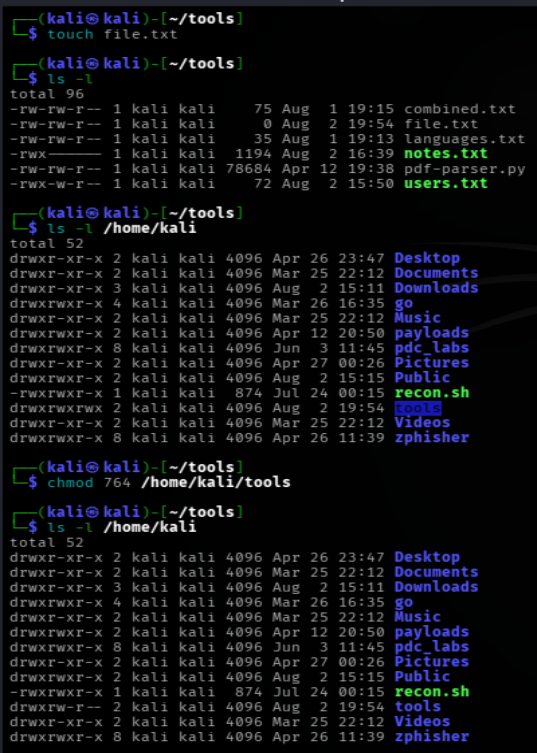
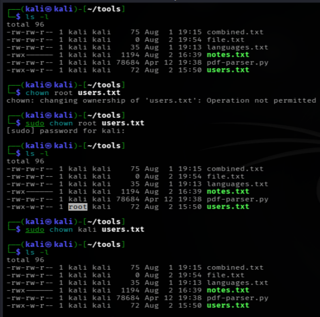
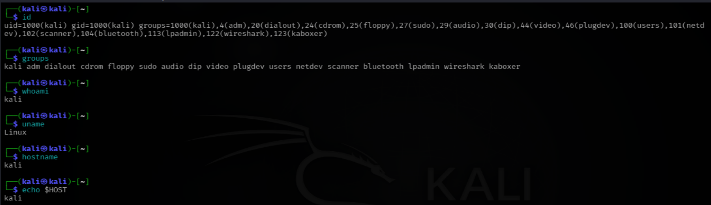

# LINUX FILES/FOLDERS PERMISSION COMMANDS DOCUMENTATION
*Maintained by Muhammad Awais*

## chmod (change mode)
This command changes who can read, write, or execute a file or directory.

Three types of permissions:

| Symbol | Meaning |
|---|---|
| r | read |
| w | write |
| x | execute |

Three groups of people:

| Symbol | Meaning |
|---|---|
| u | user, the owner of the file |
| g | group, the assigned group of the file |
| o | others, everyone else |

## chmod using symbols (u, g, o)

### chmod +rwx users.txt
no user group is specified here, so this adds read, write, and execute permission for everyone at once, owner, group, and others all together.

### chmod u-x users.txt
Removes execute permission from the owner only. The owner can still read and write the file, just cannot execute it anymore.

### chmod g-rwx users.txt
Removes all three permissions, read, write, and execute, from the group. Anyone in the file's group loses all access to it.

### chmod o-rwx users.txt
Removes all three permissions from others. Anyone who is not the owner and not in the group loses all access.

### chmod u+rwx users.txt
Adds all three permissions back to the owner, read, write, and execute.

### chmod g+rw users.txt
Adds only (r read, w write) permission to the group.

### chmod o+r users.txt
Adds only (r read) permission to others.

## chmod using numbers (octal)

Each permission has a number value:

| Number | Meaning |
|---|---|
| 4 | read |
| 2 | write |
| 1 | execute |
| 0 | no permission |

These numbers are added together to represent a combination. For example, 7 means read + write + execute (4+2+1), 5 means read + execute (4+1), and so on.
A chmod number always has three digits in a row, one for the owner, one for the group, and one for others, always in that exact order.

### chmod 777 users.txt
Owner gets 7 (read, write, execute), group gets 7 (read, write, execute), others get 7 (read, write, execute). This gives full access to absolutely everyone, which is almost never a good idea on a real system since anyone can do anything to the file.

### chmod 764 users.txt
Owner gets 7 (read, write, execute), group gets 6 (read, write), others get 4 (read only). A common, more realistic setup where the owner has full control, the group can edit but not run it, and everyone else can only view it.

### chmod 000 users.txt
Every digit is 0, meaning nobody gets any permission at all, not even the owner. Nobody can read, write, or execute the file until permissions are changed again.

## Understanding `ls -l` output

When you run:
`ls -l users.txt`
You get a line like this:
`-rw-r--r--` 1 kali kali 220 Aug 1 10:00 users.txt
The first ten characters are what matter here, and they break down into four parts.

### The first character

Tells you what type of item it is:

| Symbol | Meaning |
|---|---|
| - | a regular file |
| d | a directory |
| l | a symbolic link |

### The next nine characters, in three pairs of three
After that first character(-, d, l), the remaining nine characters are split into three groups of three, and each group represents one of the three permission sets discussed earlier, in this exact order:

`rw-  r--  r--`
owner  group  others

Each group of three follows the same pattern every time: read, write, execute, shown as `r`, `w`, `x`. If a permission is missing, a dash `-` takes its place instead.

So reading `rwxrw-r--` breaks down as:

| Group | Permissions | Meaning |
|---|---|---|
| Owner | rwx | can read, write and execute |
| Group | r-- | can read and write only |
| Others | r-- | can only read |

## What permissions a file gets by default
A file gets read(r),write(w) permission by default and not execute(x) permission because it is just data when created, nothing in it is meant to run yet. It is also a safety gate, so no script can silently execute without permission being given first. Execute permission usually has to be added manually afterward with `chmod +x`. Linux does not trust a file until you tell it to.
Most systems default a newly created file to something like:
`-rw-r--r--`
Which means the owner can read and write, and everyone else can only read.

A newly created directory behaves a bit differently by default, it usually looks like:
`drwxr-xr-x`
Directories get execute permission by default because execute on a directory does not mean "run it like a program", it means "you are allowed to enter and look inside it". Without execute permission on a directory, you cannot `cd` into it at all, even if you technically have read permission on it.

## chown (change owner)
This command changes who owns a file. This usually requires root privileges, since changing ownership is a sensitive action that a regular user is not normally allowed to do to files they do not already own.

### chown root users.txt
This changes the owner of `users.txt` to the root user. Since this affects ownership, it typically needs to be run with `sudo`:
`sudo chown root users.txt`

## id
This shows your current user ID (UID), group ID (GID), and every group you belong to.

`id`
uid=1000(kali) gid=1000(kali) groups=1000(kali),27(sudo)
This means the username is "kali", the UID is 1000, and this user is also part of the "sudo" group, which is what allows running admin level commands.

## groups
This simply lists which groups the current user belongs to.

## Commands discussed in this file for "permissions"

| Command | Variants used |
|---|---|
| `chmod` | `chmod +rwx users.txt`, `chmod u-x users.txt`, `chmod g-rwx users.txt`, `chmod o-rwx users.txt`, `chmod u+rwx users.txt`, `chmod g-x users.txt`, `chmod o-wx users.txt`, `chmod 777 users.txt`, `chmod 764 users.txt`, `chmod 000 users.txt` |
| `chown` | `chown root users.txt` |
| `id` | `id` |
| `groups` | `groups` |