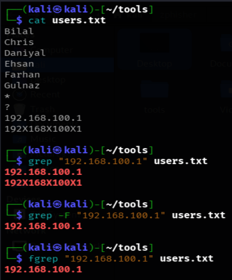
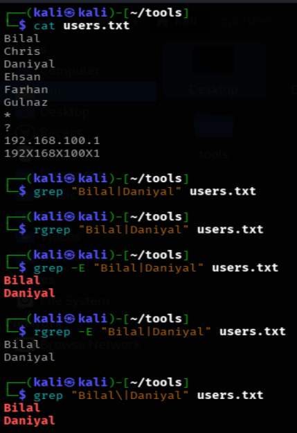
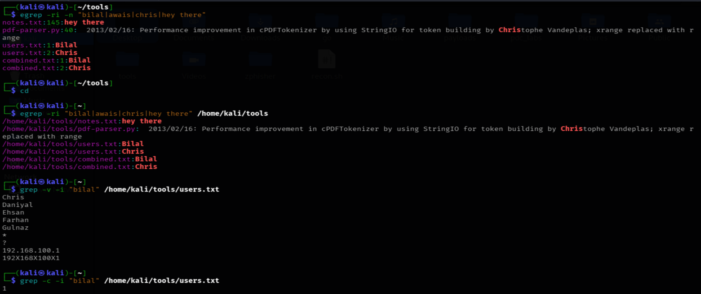

# LINUX GREP FAMILY COMMANDS DOCUMENTATON
*Maintained by Muhammad Awais*

## grep
This command searches inside a file (or files) for a specific pattern of text, and prints only the lines where that pattern is found.

Example:
`grep "error" logfile.txt`
This shows every line in `logfile.txt` that contains the word "error".

## grep flags and their shortcut command names

Several grep flags actually have their own dedicated shortcut commands that do the exact same thing. Knowing this avoids confusion and duplicate learning.

| grep flag | Equivalent standalone command | What it changes |
|---|---|---|
| `grep -E "pattern"` | `egrep "pattern"` (exended grep) | Turns on extended regex, so symbols like `|`, `+`, `?`, `()` work directly without needing a backslash |
| `grep -F "pattern"` | `fgrep "pattern"` (fixed grep) | Turns off regex entirely, the pattern is treated as plain literal text, dots and other symbols mean exactly themselves |
| `grep -r "pattern"` | `rgrep "pattern"` (recursice grep) | Searches recursively, going into every subfolder inside the given directory instead of just one file |

So instead of memorizing four separate tools, it is really just one tool, `grep`, with three optional behavior switches. The standalone commands (`egrep`, `fgrep`, `rgrep`) are just older, shorter aliases for typing those same flags.

## The real difference between grep and fgrep, explained with a scenario

Imagine a file has these two lines:
192.168.100.1
192X168X100X1

Running:
`grep "192.168.100.1" users.txt`
This will actually match both lines. The reason is that `.` in regex means "any character at all", so it happily matches the letter X in the second line too, not just an actual dot.

Running:
`fgrep "192.168.100.1" users.txt` or `grep -F "192.168.100.1" users.txt`
This will only match the first line, the one with real dots. `fgrep` treats `.` as a literal dot and nothing else, so no unexpected matches slip through.
If a file only contains clean, well formatted data with no lookalike patterns, both commands can appear to give the exact same result.

## Why an OR search can silently fail with basic grep or rgrep

Since `rgrep` is really just `grep -r` under the hood, it also uses basic regex by default, not extended. This means the pipe symbol `|`, which is commonly used to mean "OR", does not actually behave as OR unless extended mode is turned on.

Running:
`rgrep "awais|banana|apple|chris"` or `grep -r "awais|banana|apple|chris"`
This does not search for any of those four words. Instead it searches for one long literal line that contains all of them joined together with pipe symbols, which almost never actually exists in a real file, so the result comes back empty.

To make OR searches actually work, extended mode has to be enabled:
`rgrep -E "awais|banana|apple|chris"`  or `grep -E "awais|banana|apple|chris"`
or the same thing using a backslash in basic mode:
`rgrep "awais\|banana\|apple\|chris"` or `grep "awais\|banana\|apple\|chris"` 

## Common flags that work with all of them

| Flag | What it does |
|---|---|
| `-i` | Case insensitive search, matches Error, ERROR, and error all the same |
| `-v` | Reverse match, shows only the lines that do not match the pattern |
| `-n` | Shows the line number next to every match |
| `-c` | Shows only a count of how many lines matched, not the lines themselves |

## Real life scenarios

Checking a log file for failed login attempts:
`grep "Failed password" auth.log`

Searching for several possible warning levels at once:
`egrep "critical|warning|error" system.log`
or the same thing:
`grep -E "critical|warning|error" system.log`

Searching for an exact IP address without regex confusion:
`fgrep "192.168.100.1" config.txt`

or the same thing:
`grep -F "192.168.100.1" config.txt`

Searching an entire project folder for a hardcoded password left in the code:
`rgrep -i "password" /home/kali/myproject`
or the same thing:
`grep -ri "password" /home/kali/myproject`

## Commands discussed in this file for "grep family"

| Command | Variants used |
|---|---|
| `grep` | `grep "pattern" filename`, `grep -i`, `grep -v`, `grep -n`, `grep -c`, `grep -E`, `grep -F`, `grep -r`, `grep -ri` |
| `egrep` | `egrep "pattern1\|pattern2"` (same as `grep -E`) |
| `fgrep` | `fgrep "pattern"` (same as `grep -F`) |
| `rgrep` | `rgrep "pattern"`, `rgrep -E "pattern1\|pattern2"`, `rgrep -i "pattern"` (same as `grep -r`) |