# LINUX USER MANAGEMENT COMMANDS DOCUMENTATION
*Maintained by Muhammad Awais*

## useradd vs adduser

Both create a new user, but they operate at different levels.

`useradd` is low level and basic. It does not do anything extra unless you tell it to with a flag. It does not create a home directory by default, does not ask for a password, and has no interactive prompts. It is commonly used in scripts and automation because it is predictable and does not stop to ask questions.

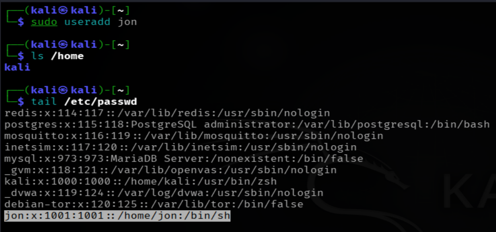

`adduser` is a high level, friendlier wrapper built on top of `useradd`, available on Debian, Ubuntu, and Kali. It is interactive, it creates the home directory automatically, asks for a password right away, and even asks for optional details like full name and phone number, which can just be skipped by pressing Enter.

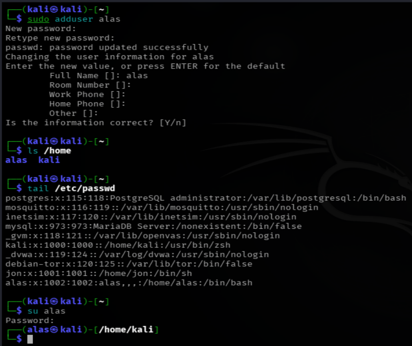

| | useradd | adduser |
|---|---|---|
| Level | Low level, basic | High level, friendly wrapper |
| Home directory | Manual, needs -m | Automatic |
| Password | Not asked | Asked interactively |
| Prompts | None | Step by step |
| Best for | Scripts, automation | Manual, everyday use |

## useradd -m -s /bin/bash username, and why it has no password by defaul
`sudo useradd -m -s /bin/bash username`

Breaking this down:
- `-m` creates the home directory automatically, for example `/home/user`, since `useradd` does not do this on its own
- `-s /bin/bash` sets the default shell for this user to bash
- `username` is the new username
This command creates the user completely, but it does not set a password. The account exists, the home directory exists, the shell is set, but nobody can log in with it yet, since there is no password attached at all.

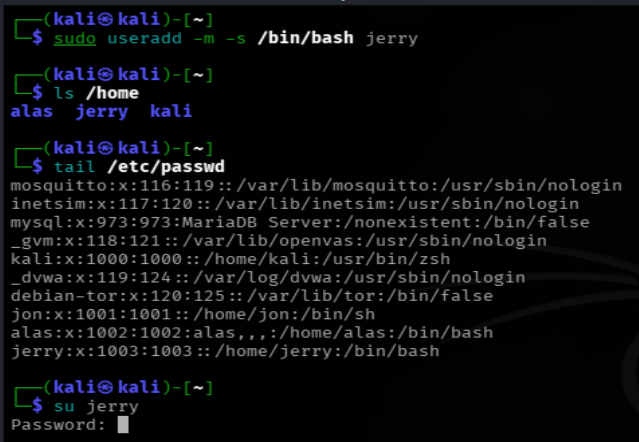

### How to add the password manually afterward
`sudo passwd jerry`
This will ask for a new password, then ask again to confirm it. Once done, the user "jerry" can log in normally.

Full working sequence:
```
sudo useradd -m -s /bin/bash idrees
sudo passwd idrees
```
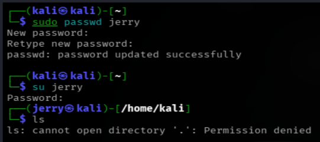

### Setting the password in one line with chpasswd

If a plain password needs to be set directly, without the interactive `passwd` prompt, `chpasswd` handles the encryption automatically:
```
sudo useradd -m -s /bin/bash tomas
echo "tomas:456" | sudo chpasswd
```
This reads the plain text password after the colon, encrypts it internally, and sets it straight into the system, all in one line.

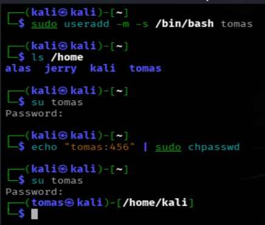

## Breaking down the openssl based useradd command
`sudo useradd -m idrees -p "$(openssl passwd -6 '12345')" -s /bin/bash`

This does everything, user creation, home directory, password, and shell, all in a single line. Here is what each part does.

`sudo` runs it with root privileges, since creating users is an admin level action.

`useradd` is the base command that creates the new user.

`-m` creates the home directory automatically.

`idrees` is the username being created.

`-p "$(openssl passwd -6 '12345')"` is the interesting part, and it actually has two steps happening together.

First, `openssl passwd -6 '12345'` runs on its own. It takes the password `12345` and encrypts it using SHA-512 (the `-6` means SHA-512), producing a hash that looks something like `$6$randomsalt$longhashstring...`.

Then, `$()` is command substitution, it means "run this first, and put whatever it outputs right here". So the hash produced by `openssl` gets dropped directly into the `-p` flag, no manual copying needed.

`-p` is the flag that sets an already encrypted password directly for the user. It expects a pre encrypted hash, not plain text, which is exactly why `openssl` was used first to produce one.

`-s /bin/bash` sets the default shell to bash, same as before.

End result: the user is created with a home directory, a bash shell, and a password that is already set and encrypted, all from a single command, useful for automation where no interactive prompt is wanted at all.

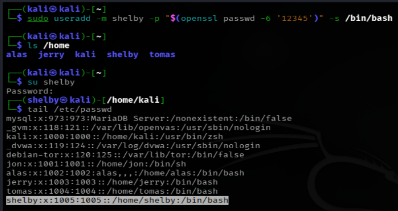

## userdel vs deluser

Same relationship as `useradd` and `adduser`.

`userdel` is low level and basic, it only deletes the user account by default. The home directory and mail files are left behind untouched unless told otherwise.

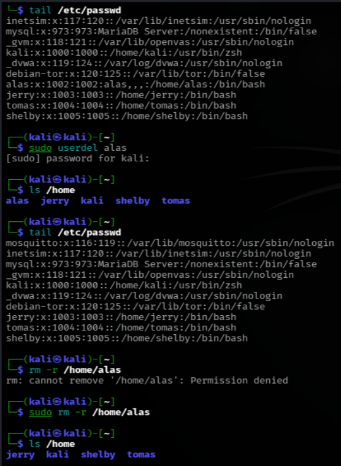

`deluser` is the Debian/Kali friendly wrapper, with more built in options, but by default it also leaves the home directory behind unless told to remove it.

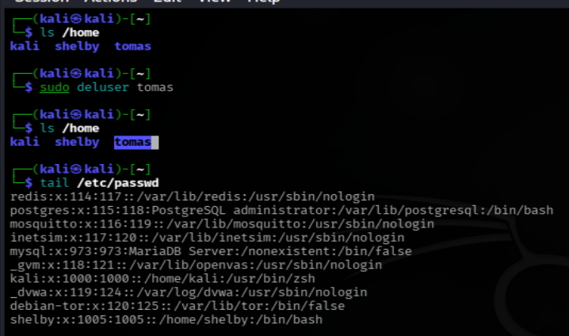

| | userdel | deluser |
|---|---|---|
| Level | Low level, basic | High level, wrapper (Debian/Kali) |
| Home directory by default | Kept | Kept |
| Extra features | -r | More, like --remove-home |

### Deleting the user along with their home directory

For `userdel`, the flag is `-r`:
`sudo userdel -r username`

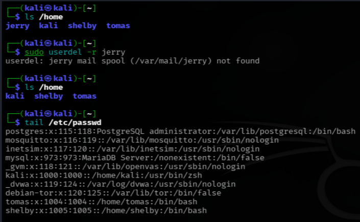

This deletes both the user account and their home directory (and mail spool).

For `deluser`, the flag is `--remove-home` instead of `-r`:
`sudo deluser --remove-home username`

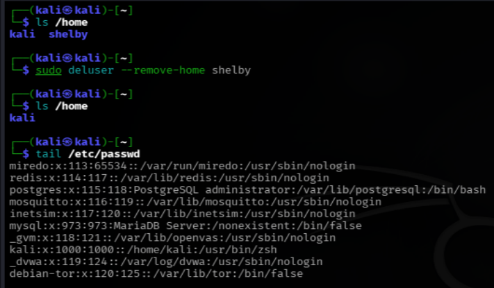

Warning: this is permanent, everything inside that home directory gets deleted along with it, there is no recycle bin to recover it from afterward.

## usermod
This modifies an already existing user, rather than creating or deleting one. Common uses:

Changing the shell of an existing user:
`sudo usermod -s /bin/zsh username`

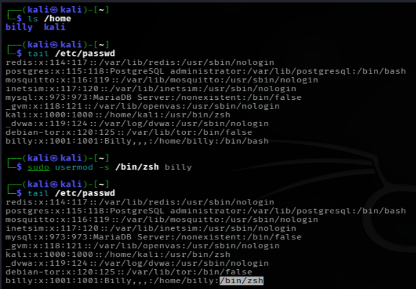

Locking or unlocking a user account:
```
sudo usermod -L username
sudo usermod -U username
```
`-L` locks the account (disables login by disabling the password), `-U` unlocks it again.

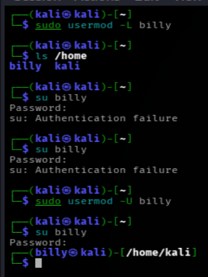

## Switching users

### su
Switches to another user account, asking for that user's password.
`su username`

Switches to a full root shell (asks for the root password):
`su -`
Switches to a specific user and loads their full environment (not just the shell, but their home directory, environment variables, everything as if they logged in directly):
`su - username`


### sudo -u
Runs a single command as another user, without fully switching into their shell.
`sudo -u username whoami`
This runs just the `whoami` command as "billy" and then returns back to the original user immediately.

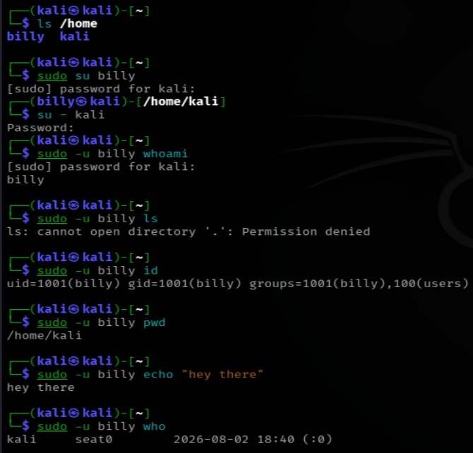

## Commands discussed in this file for "user management"

| Command | Variants used |
|---|---|
| `useradd` | `useradd -m -s /bin/bash idrees`, `useradd -m idrees -p "$(openssl passwd -6 '12345')" -s /bin/bash` |
| `adduser` | `adduser idrees` |
| `passwd` | `passwd idrees` |
| `chpasswd` | `echo "idrees:mypassword123" \| chpasswd` |
| `openssl passwd` | `openssl passwd -6 '12345'` |
| `userdel` | `userdel idrees`, `userdel -r idrees` |
| `deluser` | `deluser idrees`, `deluser --remove-home idrees` |
| `usermod` | `usermod -s /bin/zsh idrees`, `usermod -aG sudo idrees`, `usermod -L idrees`, `usermod -U idrees` |
| `su` | `su idrees`, `su -`, `su - idrees` |
| `sudo -i` | `sudo -i` |
| `sudo -u` | `sudo -u idrees whoami` |