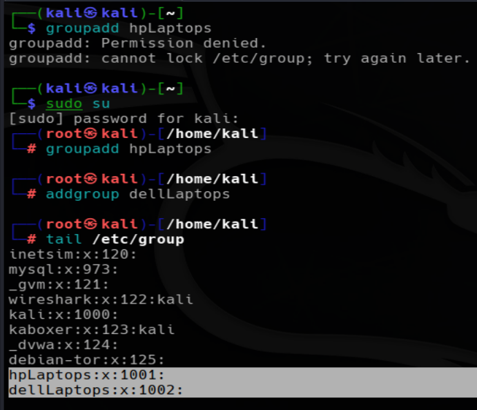
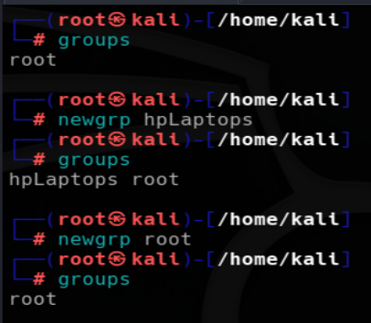
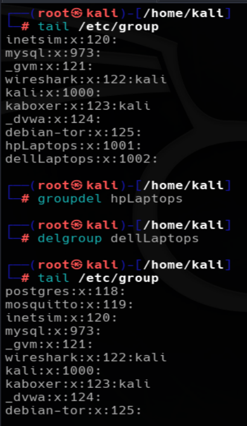
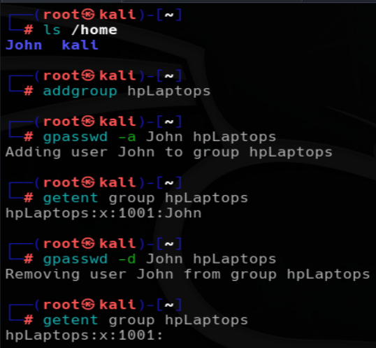
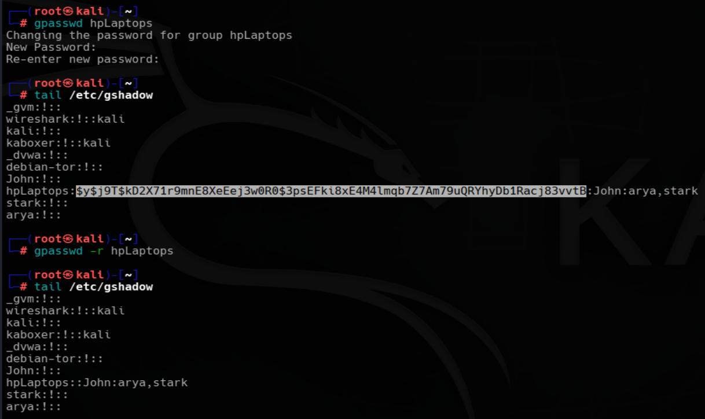
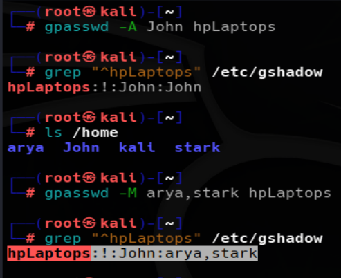
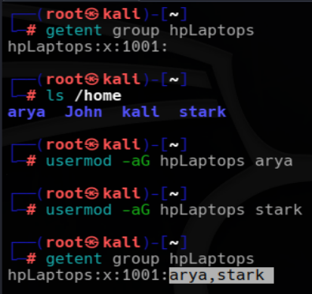
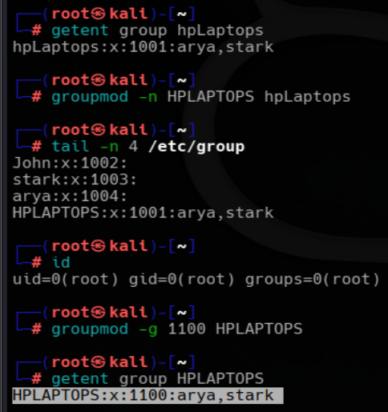

# LINUX GROUPS MANAGEMENT COMMANDS DOCUMENTATION
*Maintained by Muhammad Awais*

## Why are groups important in linux?
A group is just a way to bundle multiple users together so they can share the same permissions on a file or folder, instead of setting permission for each user one by one.
Every user already belongs to at least one group automatically (their primary group, usually named after them). On top of that, a user can be added to extra groups (secondary groups) for shared access, like a project team or a shared resource.

### groupadd vs addgroup
Both commands are used to create a new group, but they work at different levels.

`sudo groupadd <groupName>`
`groupadd` is the standard low level Linux command. It simply creates a new group without any interactive prompts. It is available on almost every Linux distribution and is commonly used in scripts and automation.

`sudo addgroup <groupName>`
`addgroup` is a high level, user friendly wrapper available on Debian based distributions such as Kali and Ubuntu. It internally uses `groupadd` but provides a simpler interface for manual administration.

## newgrp

`newgrp <groupName>`
`newgrp` switches your current session to another group without logging out. It is useful when you have just been added to a group and want to start using that group's permissions immediately instead of logging out and logging back in.

## groupdel vs delgroup
Both commands are used to delete an existing group from the system.

`sudo groupdel <groupName>`
`groupdel` is the standard low level Linux command. It removes the specified group directly and is available on almost every Linux distribution.

`sudo delgroup <groupName>`
`delgroup` is a high level wrapper available on Debian based distributions such as Kali and Ubuntu. It internally uses `groupdel` to remove the group while providing a more user friendly interface.

## gpasswd
`gpasswd` is used to manage groups and their members. It can add or remove users, assign group administrators, manage group passwords, and update group membership.

### Add a user to a group
`sudo gpasswd -a <user> <group>`
Adds an existing user to an existing group.
Notice that the user name comes first, followed by the group name.

### Remove a user from a group
`sudo gpasswd -d <user> <group>`
Removes a specific user from a group without deleting either the user or the group.

### Set/Update Group password
`sudo gpasswd <groupName>` 
Sets or Updaes a group's password

`sudo gpasswd -r <group>`
Deletes the group's password. After removing it, users cannot join the group using a group password.

### Assign a group administrator
`sudo gpasswd -A <user> <group>`
A group administrator can manage the members of that group without being the root user.
Multiple administrators can also be specified by separating them with commas.

### Set group members
`sudo gpasswd -M <user1,user2,user3> <group>`
Replaces the current member list of a group with a new list of users.
Unlike `-a`, this does not append members. It replaces the existing member list with the users you specify.

In the above screenshot focus on the las highlighted output:

| `hpLaptops` | Group name |
| `!` | Group password field (`!` means no usable password) |
| `John` | Assigned group administrator |
| `arya,stark` | Other members of the group |

## usermod -aG
`sudo usermod -aG <group> <user>`
`usermod` modifies an existing user account. One of its most common uses is adding a user to one or more supplementary groups.
`-a` means append, which keeps the user's existing group memberships.
`-G` specifies the supplementary group.
Always use `-a` together with `-G`. Using only `-G` replaces all existing supplementary groups with the new one.

Compared to `gpasswd -a`, both commands add a user to a group. The only difference is their syntax.
| `gpasswd -a` | `<user> <group>` |
| `usermod -aG` | `<group> <user>` |

## groupmod
`groupmod` modifies an existing group. It can rename a group or change its Group ID (GID).

### Renaming a group
`sudo groupmod -n <newGroupName> <oldGroupName>`
This command is used o rename a group.

`sudo groupmod -g <GID> <group_name>`
Change the Group ID

