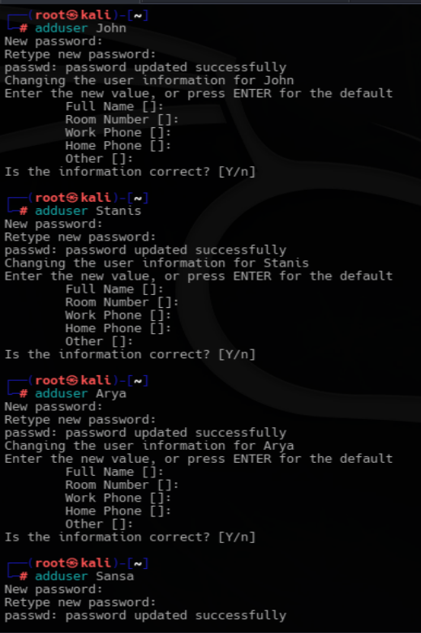
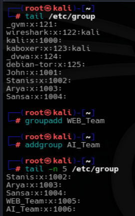
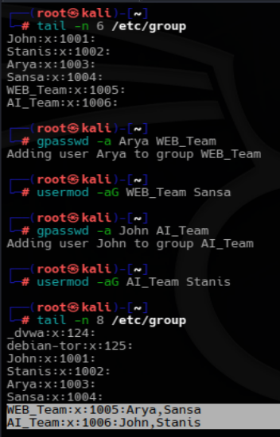
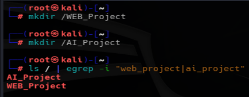
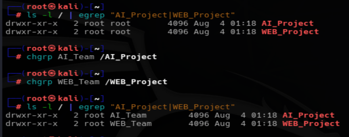
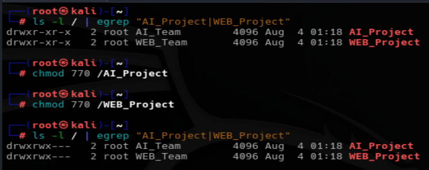
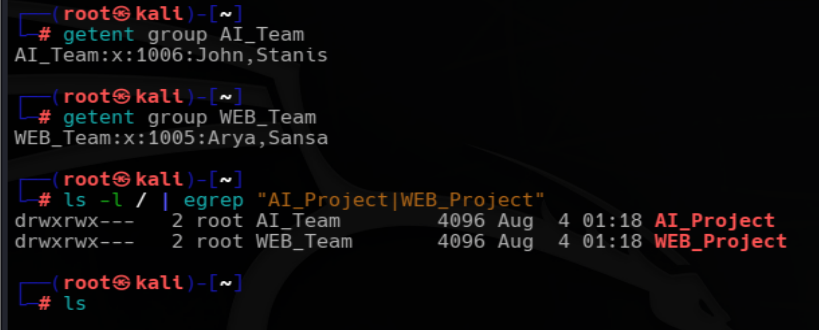
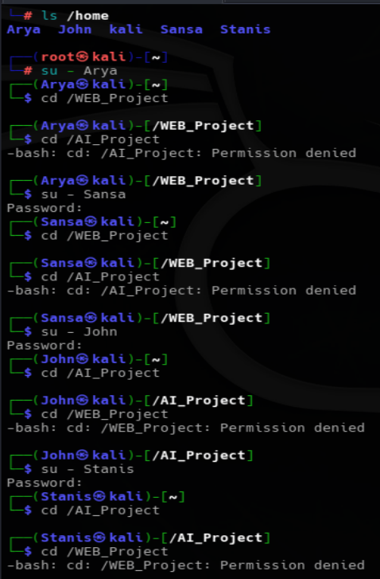
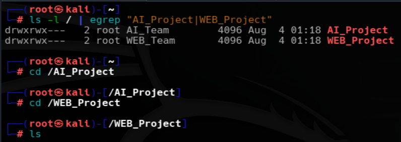

# HANDS ON PRACTICE : A REAL WORLD SCENARIO EXAMPLE
*Maintained by Muhammad Awais*

To better understand Linux group management, I created and tested a real world practice scenario instead of only learning the commands. This helped me understand how groups, permissions, and access control work together in a practical environment.

## Scenario Overview
In this practice, I assumed the role of a **root user** in a company that had received two new projects: **Web Project** and **AI Project**. Four employees were available, and each employee needed access only to the resources required for their assigned project.
To achieve this, separate Linux groups were created for each project, users were assigned to their respective groups, dedicated project directories were created, and Linux file permissions were configured to restrict unauthorized access.
The objective of this scenario was to understand how Linux groups, group ownership, and file permissions work together to provide secure access control in a real world environment.

### Step 1: Create Test Users
To simulate a real company environment, four employees were created using the `adduser` command. I used `adduser` because it automatically creates the user's home directory and allows the password to be set during the same process.

```
sudo adduser John
sudo adduser Stanis
sudo adduser Arya
sudo adduser Sansa
```


### Step 2: Create Project Groups
The company has two different projects, so two separate groups were created. Each group represents a project team. Both `addgroup`, `groupadd` commands is used to show that both commands can be used to create a group.

```
sudo groupadd WEB_Team
sudo addgroup AI_Team
```


### Step 3: Add Users to Their Project Groups
The users were assigned to their respective project groups. Both `gpasswd -a` and `usermod -aG` were used to demonstrate that both commands can be used to add a user to a group. Both commands have a little difference in their syntax.

```
sudo gpasswd -a Arya WEB_Team
sudo usermod -aG WEB_Team Sansa
sudo gpasswd -a John AI_Team
sudo usermod -aG AI_Team Stanis
```
After this step:
| Group | Members |
|--------|---------|
| `WEB_Team` | `Arya`, `Sansa` |
| `AI_Team` | `John`, `Stanis` |



### Step 4: Create Project Directories
Each project was given its own working directory.
I created these directories directly under the root filesystem (`/`) instead of inside the root user's home directory (`/root`). This is because `/root` is the private home directory of the root user, and regular users cannot access it. By creating the project directories outside `/root`, authorized group members were able to access their assigned project directories once the appropriate ownership and permissions were configured.

```
sudo mkdir /AI_Project
sudo mkdir /WEB_Project
```


### Step 5: Assign Group Ownership
I changed the group ownership of each directory so that only the corresponding project team could use it.

```
sudo chgrp AI_Team /AI_Project
sudo chgrp WEB_Team /WEB_Project
```


### Step 6: Set Directory Permissions
Permissions were set to `chmod 770`, which allows full access to the owner and the assigned group while denying access to everyone else.

```
sudo chmod 770 /AI_Project
sudo chmod 770 /WEB_Project
```


### Step 7: Testing Phase
Then I tested the users by switching to different accounts and attempting to access both project directories.

Users belonging to `AI_Team` group were able to access their assigned directory `/AI_Project` but received **Permission denied** when trying to access the other users project directory `/WEB_Project`.
Similarly, users belonging to `WEB_Team` were able to access their assigned directory `/WEB_Project` but recieved **Permission denied** when attempting to open other users project directory `/AI_Project`.




### Step 8: Root User Testing
As we all know that the root user bypasses normal permission checks,So it was able to access both project directories without any restrictions.



### Conclusion
This practice successfully simulated a real company environment where employees were divided into different project teams. Each team could only access its own project directory, while unauthorized users were blocked by Linux file permissions. The root user retained full access to all resources, as expected.