# LINUX USER, GROUP, AND SUDOERS MANAGEMENT: A REAL WORLD SCENARIO
*Maintained by Muhammad Awais*

## The Scenario
A company is starting two major projects, **Titan CMS and Nova Cloud**. Each project has three employees assigned to it. Within each project team, one employee is designated as the group administrator, responsible for managing their own team's membership. Beyond that, there is the existing system administrator account and the company owner, both of them hold full, unrestricted access to the system.
This setup reflects a real world access control model. Regular employees only get access to what they personally need. Group administrators get a small amount of extra control over their own team, along with a few specific commands they are allowed to run without needing to bother a full admin every time. Full system control stays limited to only the most trusted accounts.

## Users Involved
Seven new users need to be created:

NovaCloudTeam group: Shaheer, Yahya, Awais (Awais is the group administrator)
TitanCMSTeam group: Mazhar, Ahmad, Ali (Ali is the group administrator)
Company Owner: Saeed
The system administrator does not need to be created separately, since the existing default Kali user already holds full sudo access and fills that role.

## Step 1: Create the Users
```
sudo adduser Shaheer
sudo adduser Yahya
sudo adduser Awais

sudo adduser Mazhar
sudo adduser Ahmad
sudo adduser Ali

sudo adduser Saeed (companyOwner)
```

`adduser` is used here instead of `useradd` because it automatically creates the home directory and asks for a password interactively, which saves a couple of manual steps for each of the seven accounts.

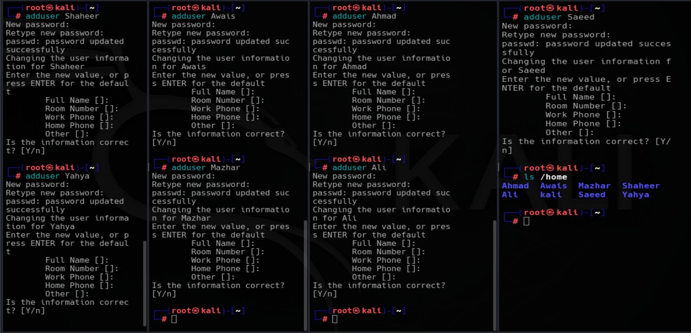

## Step 2: Create the Project Groups
```
sudo groupadd NovaCloudTeam
sudo groupadd TitanCMSTeam
```
Each project gets its own group, which will later control access to that project's shared directory.

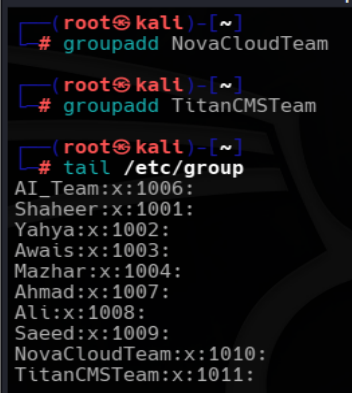

## Step 3: Add Each Employee To Their Project Group
```
sudo gpasswd -a Shaheer NovaCloudTeam
sudo gpasswd -a Yahya NovaCloudTeam
sudo gpasswd -a Awais NovaCloudTeam

sudo usermod -aG TitanCMSTeam Mazhar
sudo usermod -aG TitanCMSTeam Ali
sudo usermod -aG TitanCMSTeam Ahmad
```
Both `gpasswd -a` and `usermod -aG` commands are used for adding users to the groups.
`gpasswd -M` can also be used to add multiple users to a group at once.
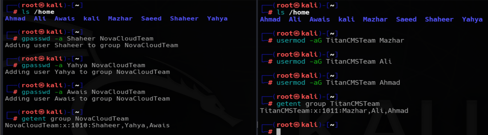

## Step 4: Assign The Group Administrators
```
sudo gpasswd -A Awais NovaCloudTeam
sudo gpasswd -A Ali TitanCMSTeam
```
This gives **Awais and Ali** the ability to manage their own team's membership directly, adding or removing people from their respective groups, without needing sudo or root involvement for that specific task.

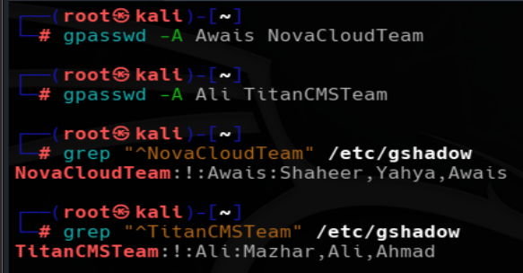

## Step 5: Create The Project Directories
The directories are created outside of `/root`, in a neutral, shared location. Creating them inside `/root` would block access entirely, since `/root` itself is locked down to the root user regardless of any permissions set on folders inside it.

```
sudo mkdir -p /Projects/NovaCloudProject
sudo mkdir -p /Projects/TitanCMSProject
```

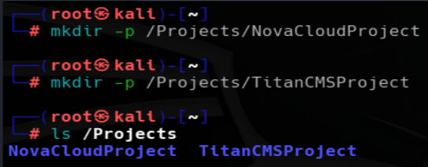

## Step 6: Set Group Ownership And Permissions On The Directories
```
sudo chgrp NovaCloudTeam /Projects/NovaCloudProject
sudo chgrp titanGrp /projects/TitanCMSProject

sudo chmod 770 /Projects/NovaCloudProject
sudo chmod 770 /projects/TitanCMSProject
```

`770` gives full read, write, and execute access to the owner and to the assigned group, while giving no access at all to anyone outside that group. This means `NovaCloudTeam` group members can work inside `NovaCloudProject` directory, `TitanCMSTeam` group members can work inside `TitanCMSProject` directory, and neither team can see or touch the other project's files.

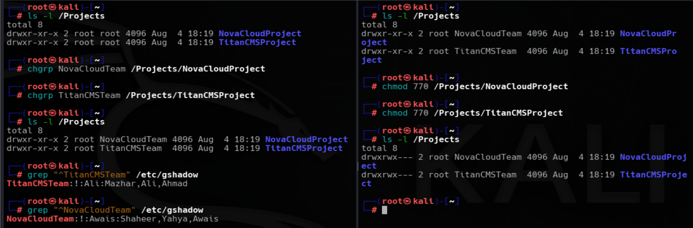

## Step 7: Give The Company Owner Full Sudo Access
`sudo usermod -aG sudo Saeed` (I assumed user **Saeed** as the company owner)
The company owner is trusted with complete system access, the same level the existing Kali user already has, since ultimate responsibility for the system rests with them.

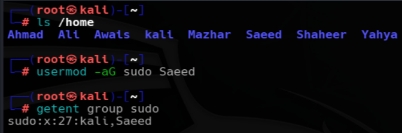

## Step 8: Give The Group Administrators Limited Sudo Access
This is the part that actually needs careful editing inside the sudoers file, since it should be applied only to the group administrators **Awais and Ali** individually, not to their entire group members.

`sudo visudo` is the recommended command for editing the **sudoers file**. It opens the file in a safe editor and checks the syntax before saving. If a mistake is found, it warns you instead of saving an invalid configuration.
It is **not considered best practice** to edit the **sudoers file** directly with editors like `nano` or `vim`. A small syntax error can prevent the `sudo` command from working, making administrative access difficult to recover.

Inside the `sudoers` file, I granted **limited administrative privileges** to the users **Awais and Ali** , who were acting as the group administrators.
```
Awais   ALL=(ALL) NOPASSWD: /usr/bin/systemctl restart apache2, /usr/bin/apt install docker.io
Ali     ALL=(ALL) NOPASSWD: /usr/bin/systemctl restart apache2, /usr/bin/apt install php
```
This configuration allows both users to restart the Apache web server without entering the root password. It also allows **Awais** to install only the `docker.io` package and **Ali** to install only the `php` package using `sudo`. They are not granted full root privileges and can execute only the commands explicitly defined in the `sudoers` file.

| Rule Part | Meaning |
|------------|---------|
| `Awais`, `Ali` | The users to whom these rules apply. |
| `ALL` | The rule is valid on all hosts. |
| `(ALL)` | The users can run the allowed commands as any user, including `root`. |
| `NOPASSWD:` | No password is required when using `sudo` for the allowed commands. |
| `/usr/bin/systemctl restart apache2` | Allows restarting the Apache web server only. |
| `/usr/bin/apt install docker.io` | Allows installing the Docker package only. |
| `/usr/bin/apt install php` | Allows installing the PHP package only. |

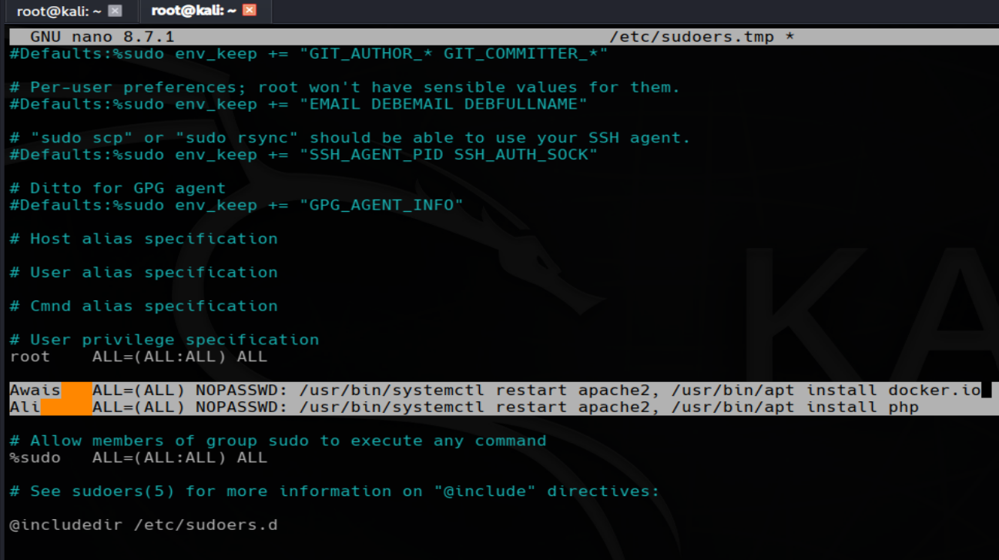

## Step 9: Testing The Setup

Access should now be checked from every angle to confirm the structure actually holds up.

**Regular team members should only reach their own project directory as shown and tested in the screenshot below:**

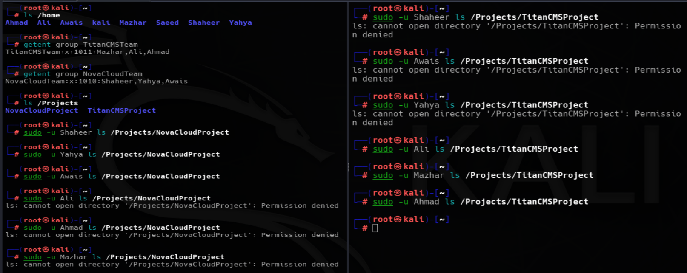

**Group administrators should be able to manage their own team without `sudo` as shown and tested in the screenshot below:**

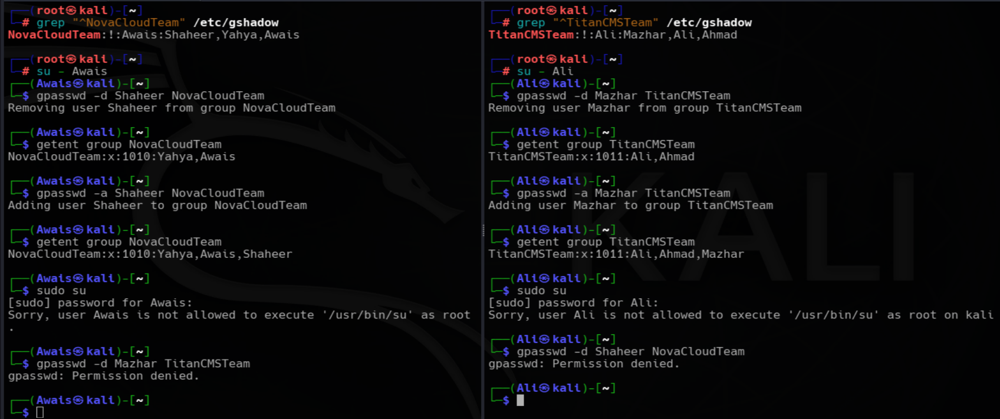

**Group administrators should be able to run their two allowed commands without a password prompt, but nothing beyond that:**
```
su - Awais
sudo systemctl restart apache2
sudo apt install docker.io

su - Ali
sudo systemctl restart apache2
sudo apt install php
```
**I switched to both user accounts and tested their sudo permissions. They could run only the commands assigned to them. Any other sudo command was denied, showing that the limited access was configured correctly. Proof shown in the screenshot below:**

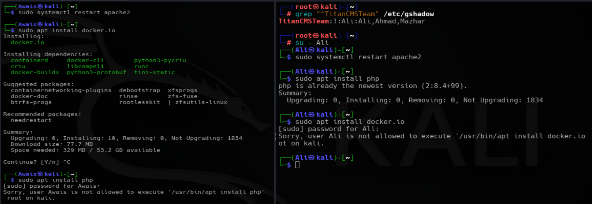

**Regular users should have no sudo access at all as shown and tested in the screenshot below:**

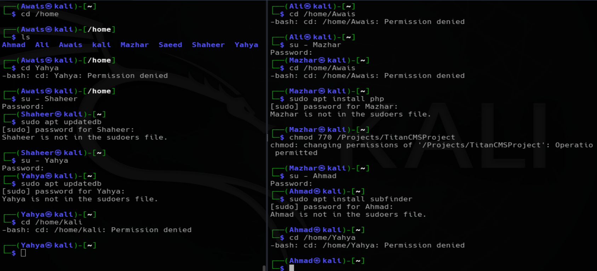

**The company owner should have complete access, identical to the default Kali** 
`su - Saeed` (I assumed the user **Saeed** as the company owner)
**Since **Saeed** is a member of the sudo group, he has full administrative privileges. He can run any command with sudo after entering his password, unlike the other users who were given only limited sudo access through the sudoers file.**
**Proof Screenshot given below:**

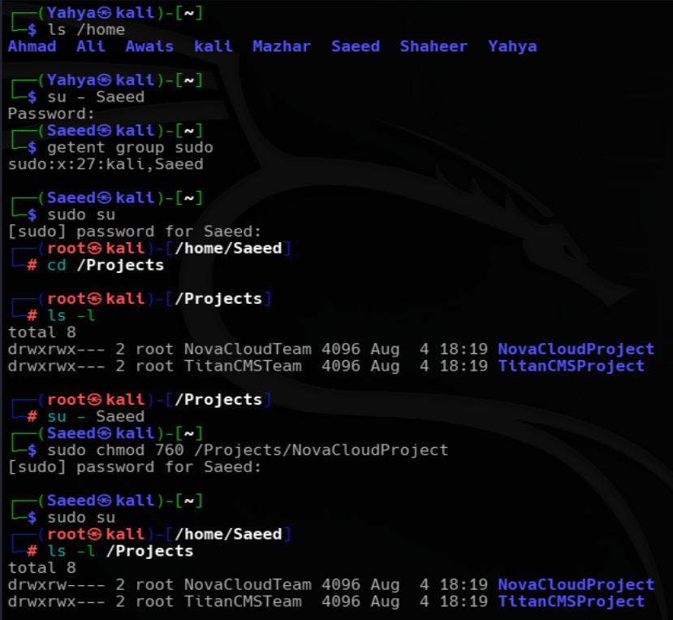

## Final Summary

| Role | Users | Directory Access | Group Management | Sudo Access |
|------|-------|------------------|------------------|-------------|
| NovaCloudTeam Group Regular Members | Shaheer, Yahya | `/Projects/NovaCloudProject` only | None | None |
| NovaCloudTeam Group Administrator | Awais | `/Projects/NovaCloudProject` only | Can manage members of the `NovaCloudTeam` group only | Can restart Apache and install `docker.io` |
| TitanCMSTeam Group Regular Members | Mazhar, Ahmad | `/Projects/TitanCMSProject` only | None | None |
| TitanCMSTeam Group Administrator | Ali | `/Projects/TitanCMSProject` only | Can manage members of the `TitanCMSTeam` group only | Can restart Apache and install `php` |
| System Administrator | kali | Full system access | Can manage all groups | Full sudo access |
| Company Owner | Saeed | Full system access | Can manage all groups | Full sudo access |

## Commands Discussed In This File For "User, Group, And Sudoers Management"
| Command | Variants Used |
|---|---|
| `adduser` | `adduser Shaheer`, `adduser Yahya`, `adduser Awais`, `adduser Mazhar`, `adduser Ahmad`, `adduser Ali`, `adduser Saeed` |
| `groupadd` | `groupadd NovaCloudTeam`, `groupadd TitanCMSTeam` |
| `gpasswd` | `gpasswd -a`, `gpasswd -A`, `gpasswd -M` |
| `usermod` | `usermod -aG TitanCMSTeam Mazhar`, `usermod -aG TitanCMSTeam Ali`, `usermod -aG TitanCMSTeam Ahmad`, `usermod -aG sudo Saeed` |
| `mkdir` | `mkdir -p /Projects/NovaCloudProject`, `mkdir -p /Projects/TitanCMSProject` |
| `chgrp` | `chgrp NovaCloudTeam /Projects/NovaCloudProject`, `chgrp TitanCMSTeam /Projects/TitanCMSProject` |
| `chmod` | `chmod 770 /Projects/NovaCloudProject`, `chmod 770 /Projects/TitanCMSProject` |
| `visudo` | `sudo visudo` |
| `su` | `su - Awais`, `su - Ali`, `su - Saeed` |
| `sudo` | `sudo systemctl restart apache2`, `sudo apt install docker.io`, `sudo apt install php` |
| `systemctl` | `systemctl restart apache2` |
| `apt` | `apt install docker.io`, `apt install php` |