# LINUX PROCESS MANAGEMENT COMMANDS DOCUMENTATION
*Maintained by Muhammad Awais*

## Introduction

Every single thing running on a Linux system, whether it is a command you typed, an app in the background, or a service quietly running since boot, exists as a process. Process management is how you see what is actually happening on a machine right now, figure out what is eating up CPU or memory, adjust how much priority something gets, and shut down anything that is misbehaving or no longer needed.
This matters a lot in real world admin work. A slow server, a frozen script, a scan that needs to keep running after you disconnect, all of these come back to understanding processes.

## Viewing Running Processes

### ps (process status)
Basically shows the processes running in your current terminal session, nothing more

`ps`

### ps aux
This is the one actually used day to day, it shows every process running on the whole system, not just the current terminal.

`ps aux`

The output includes who owns the process, its process ID (PID), how much CPU and memory it is using, and the exact command that started it.

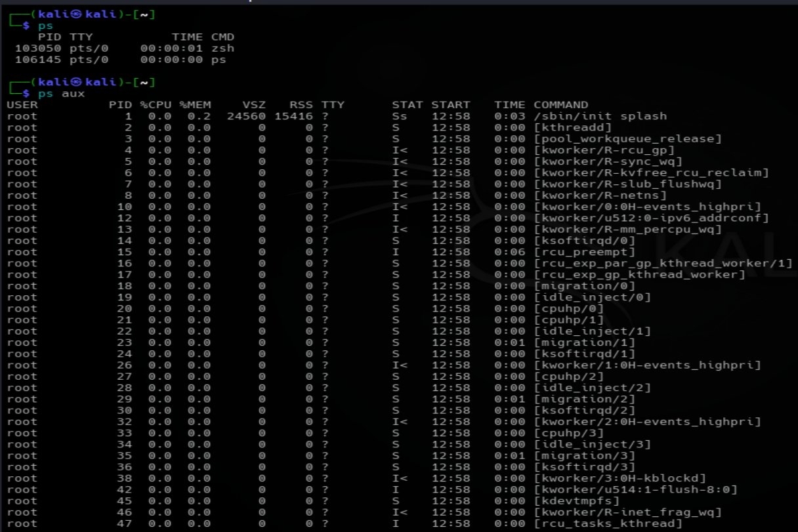

## Monitoring Processes Live

### top
Shows a real time, constantly refreshing view of everything running on the system, along with overall CPU usage, memory usage, system load, and uptime. It is just like the windows task manager.

`top`

A few useful keys while inside `top`:

| Key | What it does |
|---|---|
| P | Sort by CPU usage |
| M | Sort by memory usage |
| k | Kill a process |
| q | Quit |

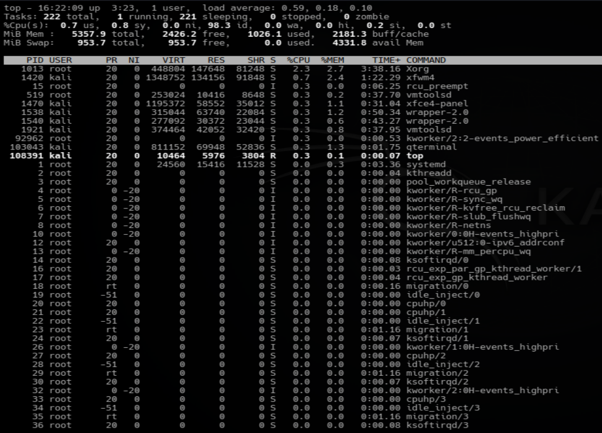

### htop
Basically an upgraded, friendlier version of `top`. It supports mouse clicks, searching, filtering, a tree view of parent and child processes, and color coded bars for CPU and memory.

`htop`

Useful keys inside `htop`:

| Key | What it does |
|---|---|
| F3 | Search |
| F4 | Filter |
| F5 | Tree view |
| F6 | Sort |
| F9 | Kill a process |
| F10 | Exit |

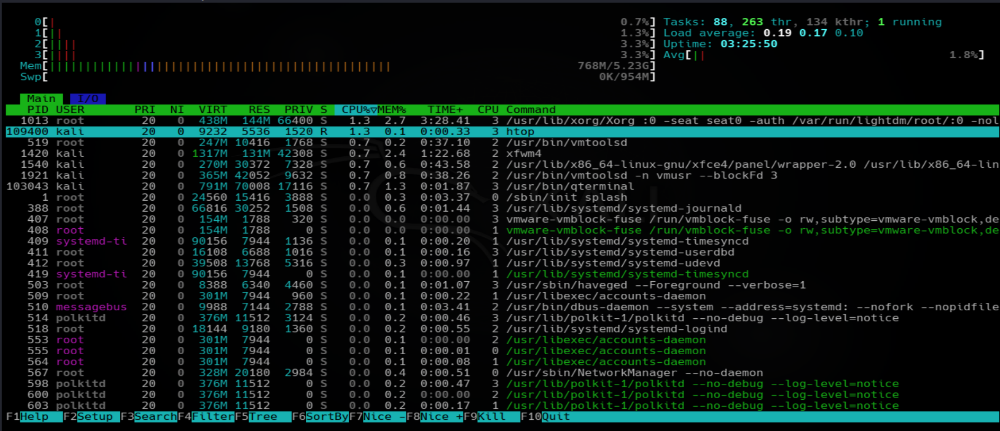

## Finding What Is Using Too Much CPU
When a system feels slow, the first step is figuring out which process is the actual cause.
Inside `top`, press `P` to sort everything by CPU usage, the heaviest process will be seen at the first(top) row.

Inside `htop`, sort by the CPU column the same way.

## Process Priority
Linux decides how much CPU time each process gets based on something called a nice value. A lower nice value means higher priority, a higher nice value means the process gets pushed to the back of the line.
```
-20   highest priority
0     default priority
19    lowest priority
```

### Starting a process with a specific priority

`nice -n 10 command`


Example:
`nice -n 10 ping google.com`

As shown in the screenshot below, I started the `ping google.com` process with a Nice value of **10** in the left terminal. In the right terminal, the htop output confirms this by showing 10 in the **NI (Nice)** column for the ping process.
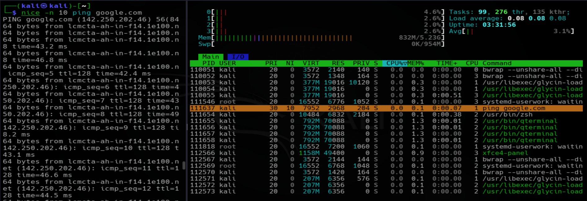

### Changing the priority of a process that is already running

`renice 10 -p PID`

Example:
`renice 10 -p 117091`

To confirm the change actually took effect:
`ps -o pid,ni,cmd -p PID`

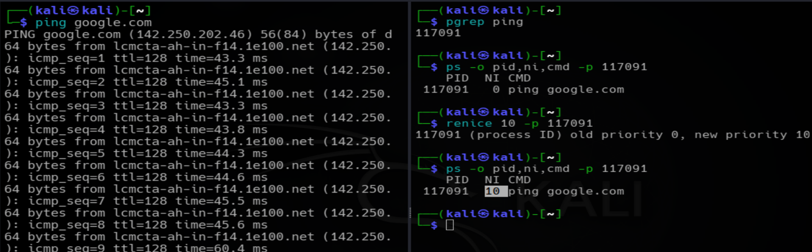

## Terminating Processes

### kill
Sends a termination request to a process using its PID.

`kill PID`

Example:
`kill 118738`

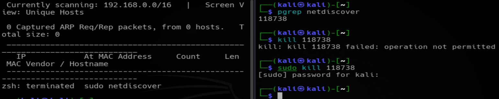

### kill -9
A forceful version of kill, used when a normal kill does not work and the process refuses to close.

`kill -9 PID`

Example:
`kill -9 128286`

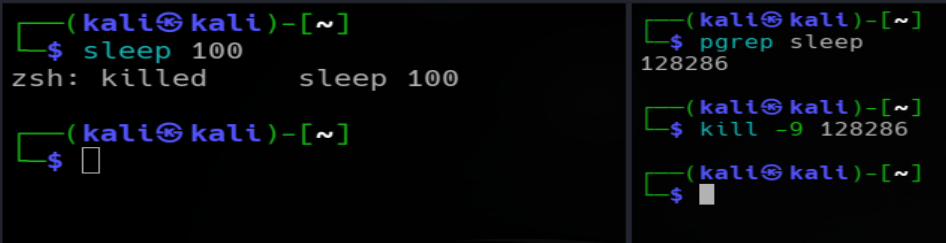

### killall
Kills a process by name instead of needing to look up its PID first.

`killall process_name`

Example:
`killall ping`

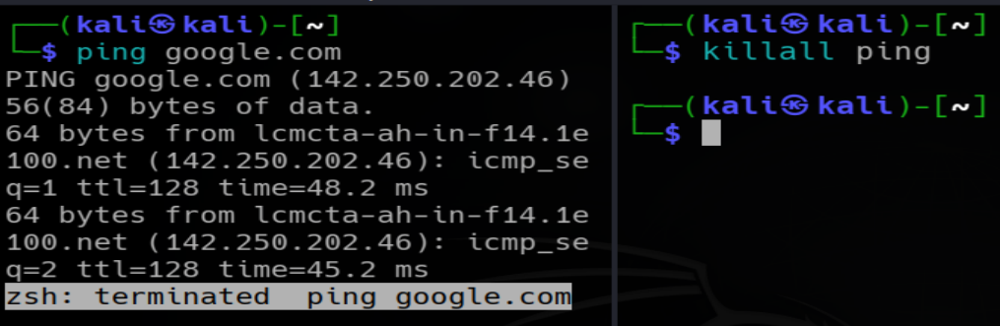

## Foreground and Background Processes
Picture this real scenario. You start a scan that will take thirty minutes:
`nmap -A 192.168.1.0/24`
But you still need to run other commands in that same terminal. Waiting thirty minutes is not an option, and stopping the scan is not an option either. This is exactly why foreground and background processes exist.

### Foreground process
A foreground process takes over the terminal completely, you cannot type anything else until it finishes or you stop it.

`ping google.com`
The terminal stays stuck on this until you press `Ctrl + C`.
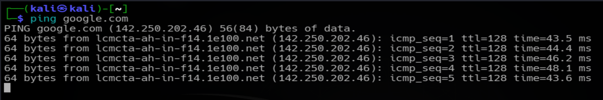

### Running something directly in the background
Adding an `&` at the end sends a command straight to the background, handing your prompt back immediately.

`sleep 300 &`

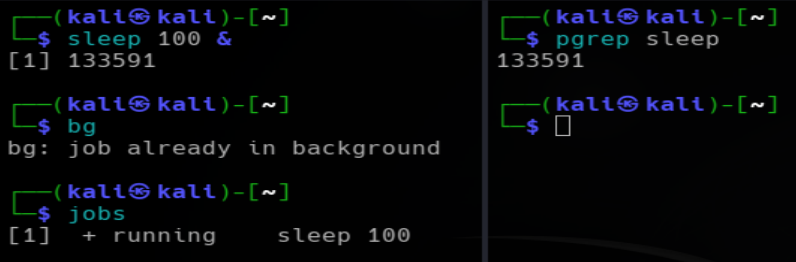

`ping google.com &`

The `ping` command continues running until it is stopped manually. Even when started in the background, it keeps sending ICMP requests and writing its output to the same terminal. As a result, the output may mix with your command prompt and make the terminal difficult to read.

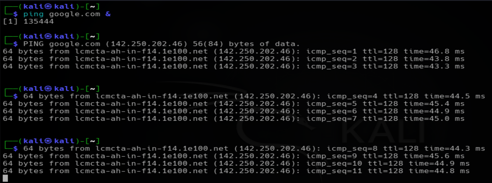

To keep the terminal clean, redirect the output to a file:

`ping google.com > pingOutput.txt &`

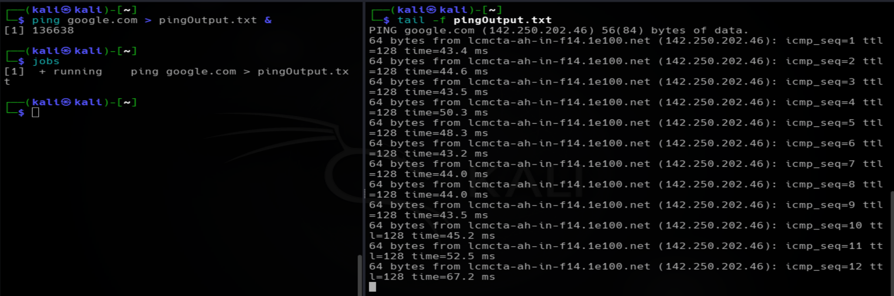

Now the `ping` process runs in the background, and all of its output is saved in **pinOutput.txt** instead of being displayed on the terminal.

### Ctrl + Z
This does not kill anything, it only pauses (suspends) the current foreground process.

`ping google.com`

Then press `Ctrl + Z`, and you get something like:
```
[1]+ suspended ping google.com
```
The process is still alive, just frozen in place.

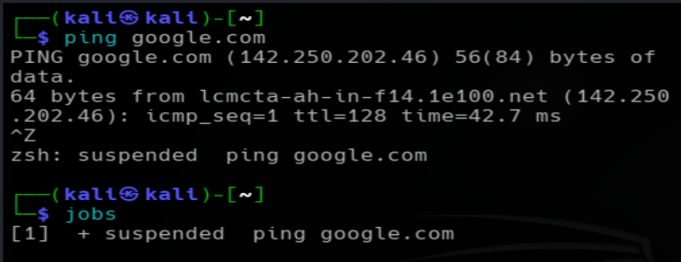

### jobs
Lists every background or suspended job tied to the current terminal session.

`jobs`

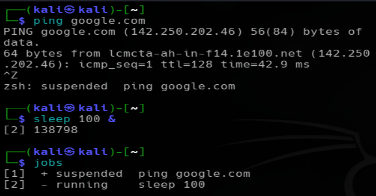

### bg
Resumes a suspended process, but keeps it running in the background instead of bringing it back to the foreground.

`bg`

### fg
Brings a background process back into the foreground, as if you had run it directly.

`fg`

If there are several jobs running at once, a specific one can be targeted using its job number:
```
fg %2
bg %3
```
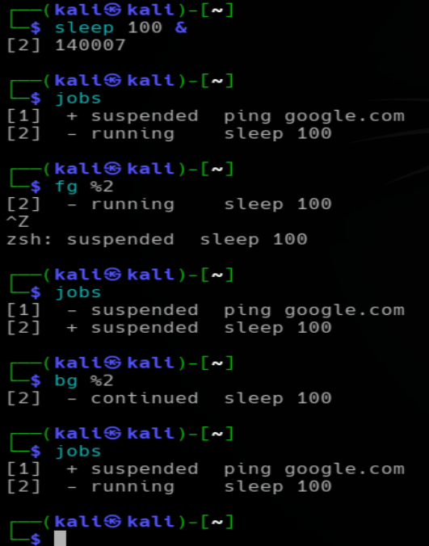

### Stopping a background process
Since `Ctrl + C` only affects the current foreground process, a background one needs a different approach.

Using the job number:
```
jobs
kill %2
```

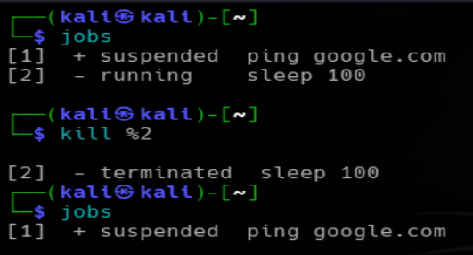

Using the PID directly, which is shown the moment the process starts in the background:

`kill PID, kill -9 PID`

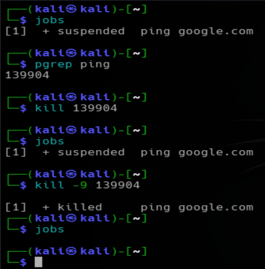

Or bring it to the foreground first, then stop it normally:

`fg %x` followed by `Ctrl + C`.

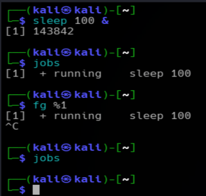

## Keeping a Process Running After the Terminal Closes
Some processes need to keep going even if the SSH session drops or the terminal window gets closed, a backup script for example.

`nohup command &`

Example:
`nohup ping google.com &`

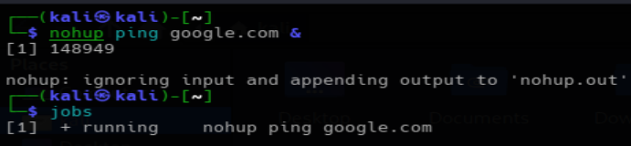

Its output gets saved into a file called `nohup.out` instead of printing to a terminal that might not even exist anymore.

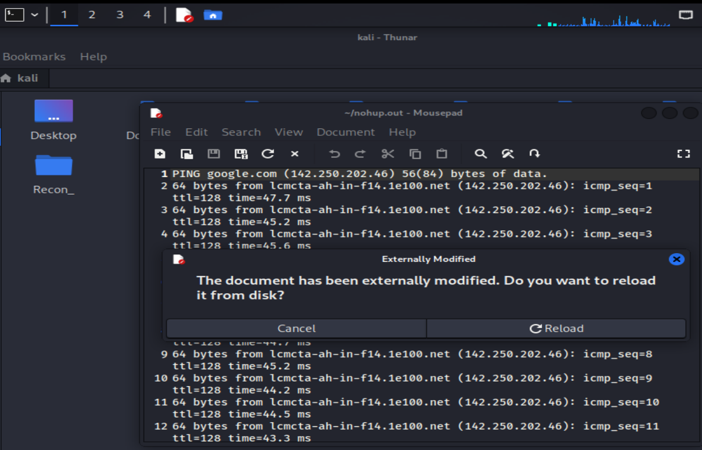

## A Few More Useful Commands

### pgrep
Finds the PID of a process by searching for it by name, instead of scrolling through `ps aux` manually.

`pgrep firefox`

### pidof
Basically the same idea as `pgrep`, it finds the PID of a running process by name, but it is a bit older and more limited, it only matches exact process names rather than pgrep's more flexible pattern matching.

`pidof firefox`

Output is just the PID number, or numbers if multiple instances are running:

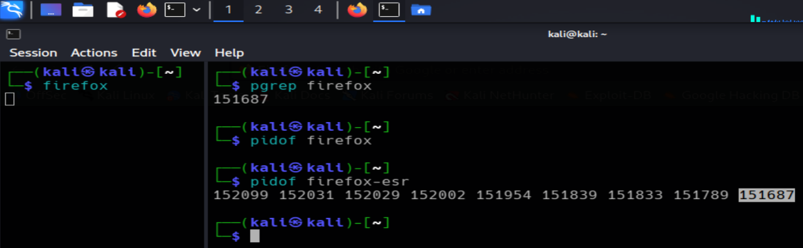

For most day to day use, `pgrep` ends up getting used more since it supports partial matches and extra filters like `-u` for user or `-l` to show the name alongside the PID, but `pidof` still shows up in older scripts, so it is worth knowing it does basically the same job.

### pkill

Sends a signal (like kill would) directly to a process found by name.

`pkill firefox`

One thing worth knowing, `-9` (the force flag) is not just a `kill` thing, it works the exact same way with `killall` and `pkill` too, since all three are really just different ways of sending a signal to a process, one by PID, one by name, one by name pattern.
```
kill -9 PID
killall -9 <processName>
pkill -9 <processName>
```
All three forcefully terminate their target the same way, the only difference between them is how they identify which process to hit.

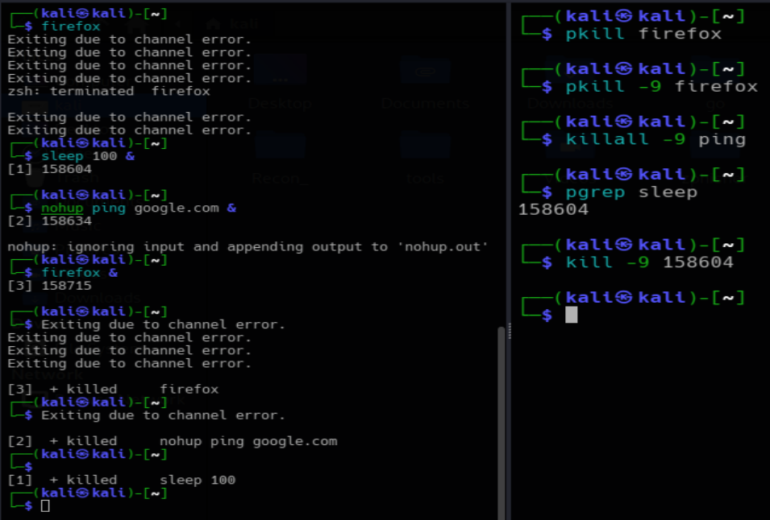

### disown
Detaches a background process from the current shell entirely, so even if the shell itself closes, the process keeps running independently.

```
firefox &
disown
```
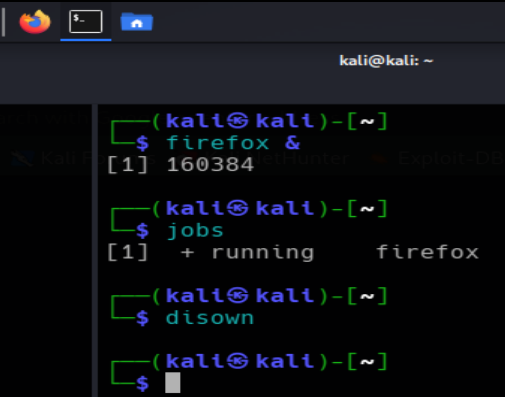

As you can see in this screenshot the started process in the terminal **firefox** is still running even after closing the terminal. That's how `disown` works.
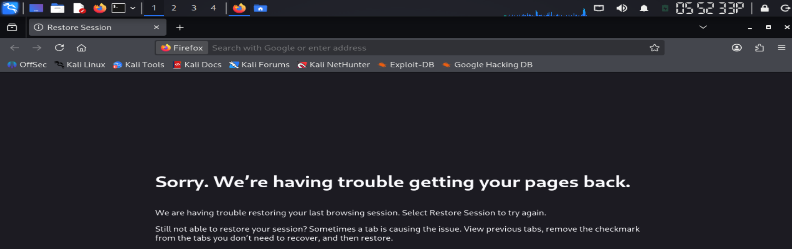

## Common Differences Worth Remembering

| Command | Purpose |
|---|---|
| Ctrl + C | Terminates the current foreground process |
| Ctrl + Z | Suspends the current foreground process |
| bg | Resumes a suspended process in the background |
| fg | Brings a background process back to the foreground |
| jobs | Lists background or suspended jobs in this shell |
| & | Starts a command directly in the background |
| nohup | Keeps a process alive even after logout |
| kill | Terminates a process by PID |
| killall | Terminates a process by name |
| pgrep | Finds a process's PID by name |
| pkill | Sends a signal to a process by name |

## Commands discussed in this file for "process management"

| Command | Variants used |
|---|---|
| `ps` | `ps`, `ps aux`, `ps -o pid,ni,cmd -p PID` |
| `top` | `top` |
| `htop` | `htop` |
| `nice` | `nice -n 10 command` |
| `renice` | `renice 10 -p PID` |
| `kill` | `kill PID`, `kill -9 PID`, `kill %1` |
| `killall` | `killall process_name` |
| `jobs` | `jobs` |
| `bg` | `bg`, `bg %1` |
| `fg` | `fg`, `fg %1` |
| `nohup` | `nohup command &` |
| `pgrep` | `pgrep firefox` |
| `pidof` | `pidof firefox` |
| `pkill` | `pkill firefox`, `pkill -9 firefox` |
| `disown` | `disown` |

## Conclusion
Process management is one of those skills that quietly separates someone who just knows Linux commands from someone who actually understands what is happening on a system. Tools like `ps`, `top`, `htop`, `nice`, `renice`, `kill`, `jobs`, and `nohup` all work together to give full control over what runs, how much of the system it gets to use, and when it stops.