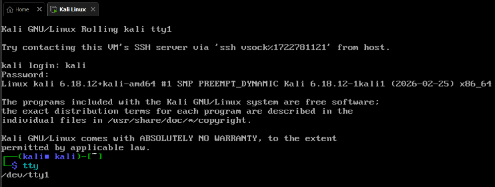
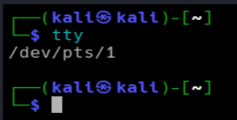
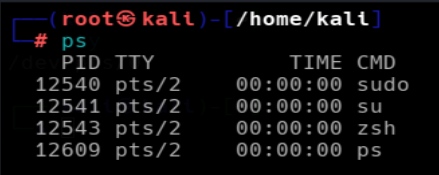
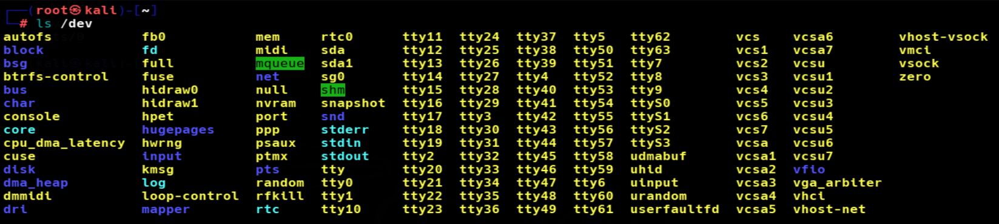
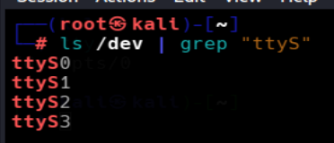
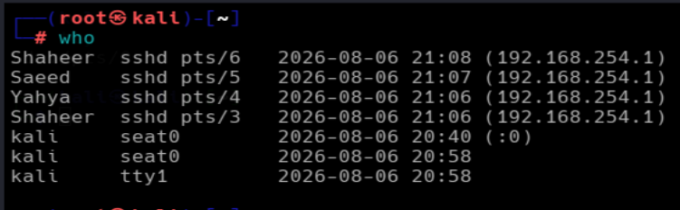
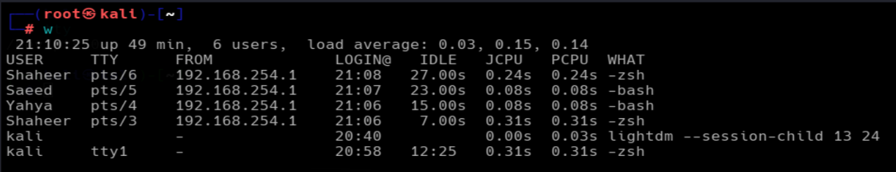
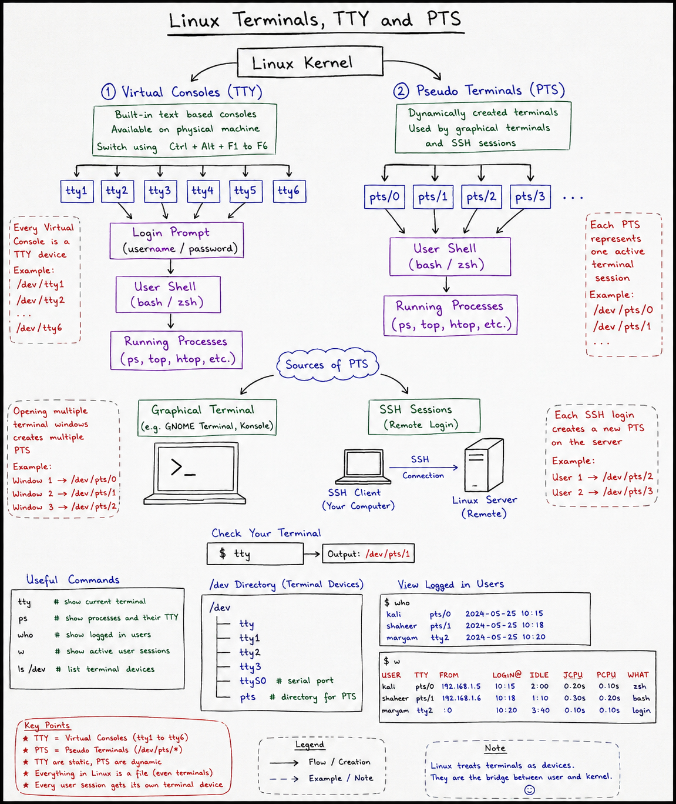

# LINUX TERMINALS, TTY and PTS DOCUMENTAION
*Maintained by Muhammad Awais*

## Introduction
Every single command you type in Linux travels through a terminal device to reach the operating system, and every result travels back through that same device to reach your screen. TTY and PTS are both names for these terminal devices, just two different kinds of them. Understanding the difference helps make sense of local logins, SSH sessions, and figuring out where a process is actually running from.

## Clearing Up the Core Confusion First between TTY and PTS

TTY is the communication channel between the user and the Linux kernel. Every command and its output pass through this channel. PTS is simply another type of TTY that performs the same function. The difference is that TTY devices are built into Linux as virtual consoles, whereas PTS devices are created automatically for graphical terminal windows and remote SSH connections.
Within that category, there are two kinds:

Physical or virtual console TTYs, the fixed ones like `tty1`, `tty2`, `tty3`, used for local, text only logins on the machine itself.

Pseudo terminals, called PTS, used by graphical terminal windows and SSH sessions, created fresh every time a new terminal or connection opens.

So a graphical terminal or an SSH session is technically still using a TTY style device, it is just a specific kind called PTS rather than the classic `tty1` style console. Every command you run inside a GNOME Terminal window or over SSH is still going through that same "channel to the kernel" concept, it is just routed through a PTS device instead of a fixed console one.

## What TTY Actually Means

TTY stands for **Teletype Terminal**. Originally this referred to an actual physical machine used to send commands to a computer, long before screens and keyboards as we know them existed. Linux still uses the name today even though there is no physical teletype machine involved anymore, it just kept the term for consistency.

## The Fixed, Built In Virtual Consoles

Linux comes with a set of built in virtual consoles, named:
```
tty1
tty2
tty3
tty4
tty5
tty6
```

These can be switched between using:
```
Ctrl + Alt + F1
Ctrl + Alt + F2
Ctrl + Alt + F3
```
and so on. Each one is a completely separate login session, meaning multiple people could technically log into the same physical machine at the same time, each using a different virtual console.
### Number of Virtual Consoles

Linux supports many TTY devices (such as `tty1` to `tty63`). However, most Linux distributions activate only the first **six virtual consoles** (`tty1` to `tty6`) by default for user logins.

The remaining TTY devices are supported by the Linux kernel but are usually not used unless they are configured for a specific purpose.



## What PTS Actually Means
**PTS = Pseudo Terminal Slave**

**Pseudo** = Fake, virtual, or software-created. It is not a physical terminal

**Terminal** = The interface where users type commands and receive output from the Linux system.

**Slave** = The terminal device connected to the user's shell. It receives input from the terminal emulator and sends output back to it.

Pseudo Terminal Slave (PTS) is a virtual terminal device created automatically by Linux for graphical terminal windows and SSH sessions.
Unlike the fixed `tty1` through `tty6....` consoles, PTS devices are not built in ahead of time, they get created dynamically, on the spot, whenever a new terminal window is opened or a new SSH connection comes in.

Examples:
```
pts/0
pts/1
pts/2
```

Every graphical terminal window and every SSH session gets handed its own PTS number.

## Easy Difference

| TTY (console style) | PTS |
|---|---|
| Fixed, built in ahead of time | Created fresh, on demand |
| Used for local, text only logins directly on the machine | Used by graphical terminal apps and SSH sessions |
| Examples: tty1, tty2 | Examples: pts/0, pts/1 |
| Switched to using Ctrl+Alt+F1, F2, etc | Opens automatically when a terminal or SSH session starts |

## Checking Which Terminal You Are Currently In

```
tty
```


This means the current shell session is running inside PTS 1, meaning it is either a graphical terminal window or an SSH connection, not one of the fixed console logins.

## Seeing Which Terminal a Process Belongs To

```
ps
```


The TTY column here shows which terminal device each process is tied to. Since all three processes show `pts/2`, they are all running inside the exact same terminal session.

## Terminal Devices Live Inside /dev
Linux treats almost everything as a file, and terminal devices are no exception. They live inside `/dev` as special device files, not regular files with actual content, but interfaces the kernel uses to handle communication.

Examples:
```
/dev/tty1
/dev/tty2
/dev/pts/0
/dev/pts/1
```


This usually shows entries like `tty`, `tty1`, `tty2`, `tty3`, `ttyS0`, and a `pts` folder.

## What are ttyS
Entries like `ttyS0`, `ttyS1`, and `ttyS2` in the **/dev** represent serial ports, used for communicating with external hardware like routers, switches, or embedded devices over a serial connection. Most everyday desktop use never touches these directly, they show up more in networking and embedded systems work.



## SSH Sessions and PTS
Every time someone connects over SSH, Linux spins up a brand new PTS for that connection. If three different users SSH in, each one gets their own separate PTS:
```
User 1 → pts/0
User 2 → pts/1
User 3 → pts/2
```
Each session works completely independently of the others.

A single user can also open multiple SSH sessions to the same machine at once, and each one still gets its own separate PTS number, working independently even though it is the same person.

## Seeing Who Is Logged In

```
who
```



This shows the username, which terminal they are using, and when they logged in.

## w
```
w
```
This gives a more detailed version, showing logged in users, their terminal, login time, how long they have been idle, and what command they are currently running(bash,zsh etc).




## Conclusion
TTY is the general idea of a communication channel between a user and the Linux kernel. PTS is not a separate, unrelated thing, it is simply the dynamically created version of that same channel, used by graphical terminals and SSH sessions, while the classic `tty1` through `tty6` consoles are the fixed, built in version used for local logins. Both do the same fundamental job, they just come from different origins and get used in different situations.