# LINUX RESOURCE LIMITS COMMANDS DOCUMENTATION
*Maintained by Muhammad Awais*

## Introduction
Linux puts limits on how much of a resource a process can use. These limits help prevent one process or user from consuming too many files, processes, memory, or other system resources.

Two important commands for working with these limits are **`ulimit`** and **`prlimit`**.

The easiest way to remember them is:

> **`ulimit` → limits for the current shell and the processes it creates.**
> **`prlimit` → view or change limits of a specific running process.**

## Resource Limits

A resource limit controls how much of a particular resource a process can use.

Examples include:

* Maximum number of open file descriptors
* Maximum number of processes
* Maximum CPU time
* Maximum stack size
* Maximum file size
* Maximum locked memory

Linux keeps these limits for individual processes.

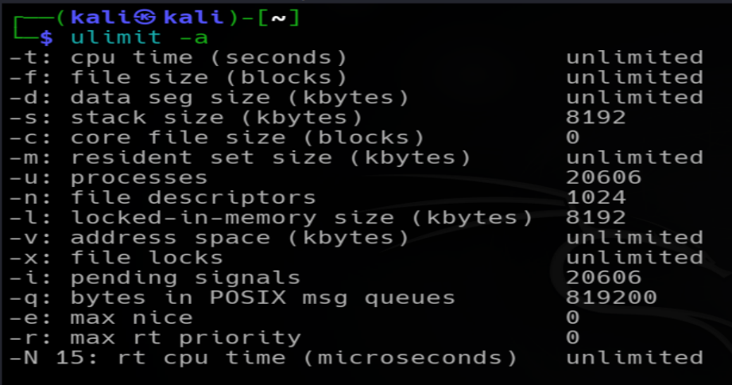

A process has two important values for most limits:

* **Soft limit**
* **Hard limit**

## Soft Limit

The **soft limit** is the limit currently enforced for the process.In easy words, Current active limit of the process.

For example:

`ulimit -Sn`

This means the current shell has a soft limit of **1024 open file descriptors**.

A process normally cannot exceed its current soft limit.

## Hard Limit

The **hard limit** is the maximum value to which the soft limit can normally be increased by the process itself.In easy words, Maximum allowed soft limit of a process.

Check it with:

`ulimit -Hn`

This means the process can normally increase its soft open-file limit up to **524288**, assuming it has the required permission. 

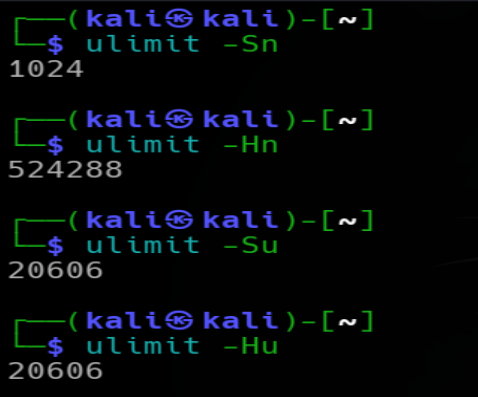

## Checking Limits with ulimit

`ulimit` is a **shell built-in command**.

Check whether the current shell has it:

`type ulimit`

This is important because `ulimit` is not normally a separate executable such as `/usr/bin/prlimit`.

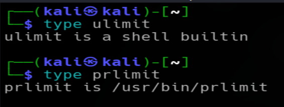

## Open File Descriptor Limit

The `-n` option controls the maximum number of open file descriptors.

Check the soft limit:

`ulimit -Sn`

Check the hard limit:

`ulimit -Hn`

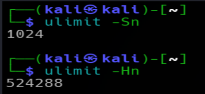

## Changing the Soft Limit

Suppose the current hard limit is high enough. You can increase the soft limit upto the hard limit value.

You can increase the current shell's soft limit:

`ulimit -Sn 3000`

Check:

`ulimit -Sn`

This change affects the **current shell**.

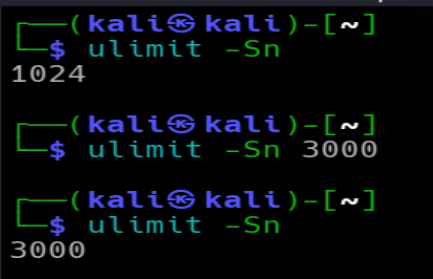

## Changing the Hard Limit

Hard Limit Rules
- A normal user cannot increase their hard limit. They can only lower it.
- A normal user can increase their soft limit, but only up to the current hard limit.
- Once a normal user lowers their hard limit, they normally cannot increase it again themselves. As shown in the screenshot below.
- A root/privileged user can increase a process's hard limit, but it is still restricted by the kernel's maximum allowed value.
- For nofile, the kernel's upper limit can be checked with:
- cat /proc/sys/fs/nr_open

For example:

`ulimit -Hn 500000`

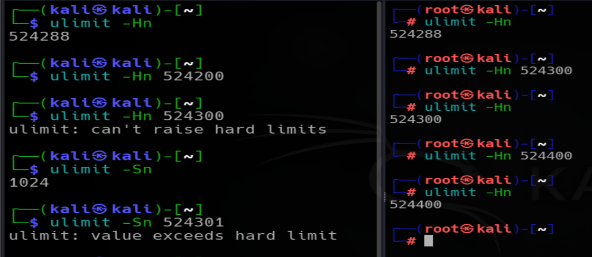

## Important Note: ulimit Is Per Process

`ulimit` does not change the limits of every process on the system.

For example, if you run:

`ulimit -Sn 2000`

you changed the limit of the current shell.

If you then start:

`ping google.com`

the `ping` process is created by that shell and inherits the shell's resource limits.

The relationship is:

```
Current Shell bin/bash/zsh (Parent Process)
     |
     └── ping google.com (Child Process)
             |
             └── This child process will Inherit the limits of the parent process
```

## New Shells

Suppose you change the limit in one shell:

`ulimit -Sn 2000`

Then start another shell from it:

`bash`

The new shell inherits the limit from its parent.

But a completely new login/session can receive limits from the system's login configuration instead.

Therefore, a `ulimit` change should not be treated as a permanent user configuration.

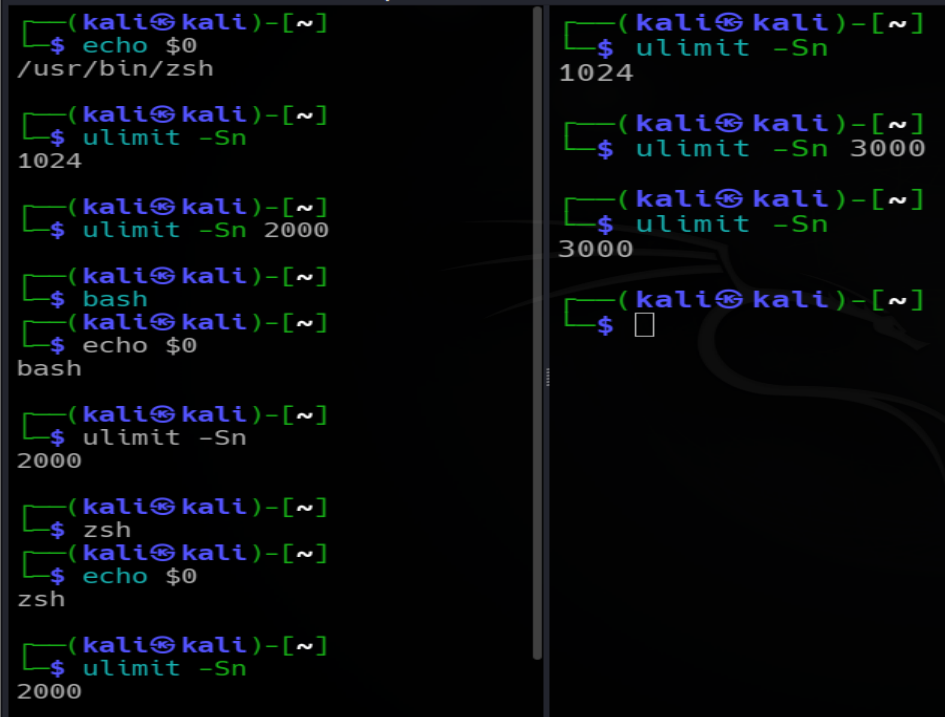

## Viewing Actual Process Limits

Linux exposes process information through `/proc`.

For the current process:

`cat /proc/$$/limits`

Here the `$$` means the PID of the current shell.

You can also check:

`echo $$`

Example:

`178639`

Then:

`cat /proc/1234/limits`

Both will give the same output.

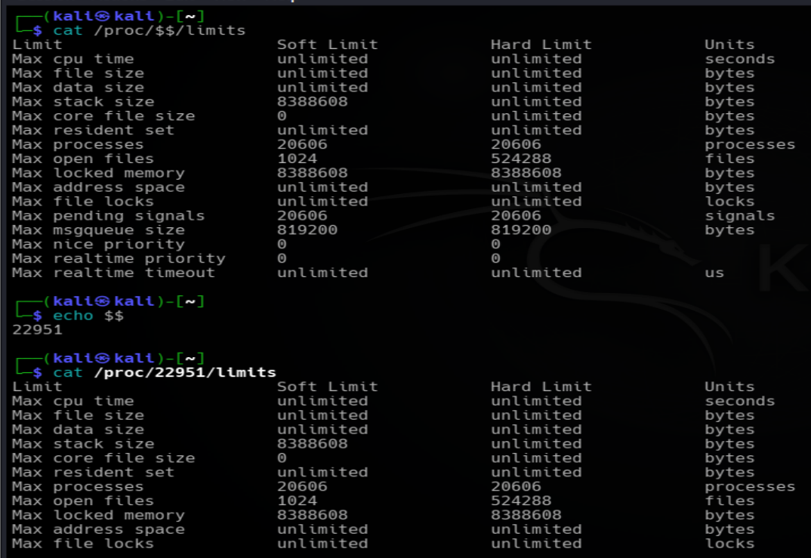

## Why /proc/PID/limits Is Important

`/proc/PID/limits` shows the limits that are **actually assigned to that specific process**.

This is especially useful when checking another process.

For example:

`cat /proc/1234/limits`

You can see the limits of PID `1234`.

As root, you can inspect limits of processes owned by other users, subject to normal Linux permission/security rules.

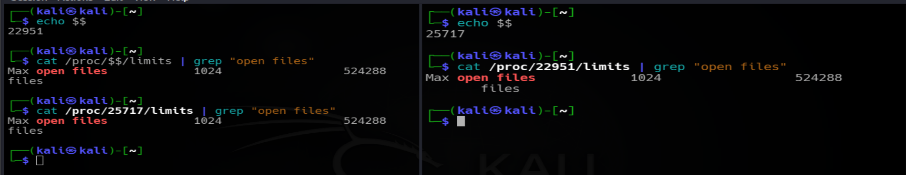

## prlimit

`prlimit` is used to **view or change resource limits of a specific process**.

Basic syntax:

`prlimit --pid PID`

For example:

`prlimit --pid 1234`

This displays the resource limits of process `1234`.

## prlimit for Open Files

To view the open-file limit of a process:

`prlimit --pid 1234 --nofile`

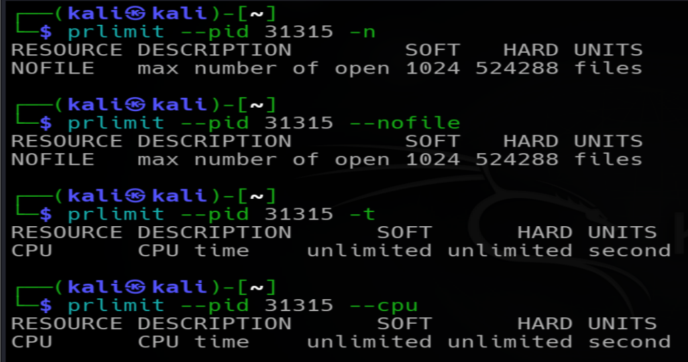

## Changing a Process Limit with prlimit

A normal user cannot change another user's process limits directly with `prlimit`. If the user belongs to the `sudo` group, they can use `sudo prlimit` to perform the change with root privileges. Simply being in the `sudo` group is not enough; `sudo` must be used with the command.

Example:

`sudo prlimit --pid 2699 --nofile=3000:5000`

This sets:

```
Soft = 4000
Hard = 500000
```

for PID `2699`.

Verify it:

`cat /proc/1234/limits | grep "open files"`


or:

`prlimit --pid 1234 --nofile`

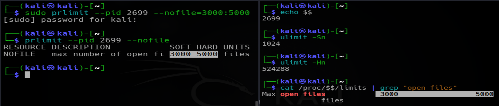

## ulimit vs prlimit

| Feature                               | `ulimit`                    | `prlimit`          |
| ------------------------------------- | --------------------------- | ------------------ |
| Type                                  | Shell built-in              | External command   |
| Main target                           | Current shell               | Specific process   |
| Can inspect current process           | Yes                         | Yes                |
| Can target another PID                | No                          | Yes                |
| Useful for child-process limits       | Yes                         | Yes                |
| Useful for an already-running process | Limited                     | Yes                |
| Common use                            | Shell configuration/testing | Process management |

The easiest rule:

- **Use `ulimit` when working from the current shell.**
- **Use `prlimit` when you need to target a particular PID.**

## Changing Another User's Process limits

Suppose user `Shaheer` owns a process:

```text
PID = 8665
USER = shaheer
```

A root user can use:

`sudo prlimit --pid 8665 --nofile=3000:500000`

The change applies to that **specific running process**.

It does not automatically become the permanent limit for all future processes created by `Shaheer`.

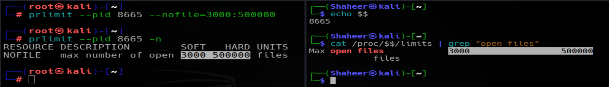

## What Happens When a New Process Is Created?

Suppose `Shaheer` has a shell:

```
zsh
  |
  └── web server
```

If the shell has:

```
Soft = 4000
Hard = 500000
```

the child web-server process normally inherits those limits.

If you use `prlimit` to change only the existing zsh process, future child processes created from that zsh can inherit the updated limits.

However, a completely new login/session may start with different configured defaults.

## Permanent User Limits

For persistent login limits, Linux commonly uses:

```
/etc/security/limits.conf
```

and:

```
/etc/security/limits.d/
```

These settings are applied through PAM when users start sessions.

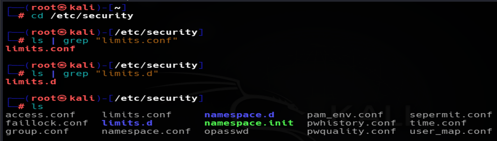

## /etc/security/limits.conf

The general format is:

```
<domain> <type> <item> <value>
```

For example:

```
Shaheer soft nofile 3000
Shaheer hard nofile 5000
```

This means:

```text
User:       shaheer
Soft NOFILE: 3000
Hard NOFILE: 5000
```

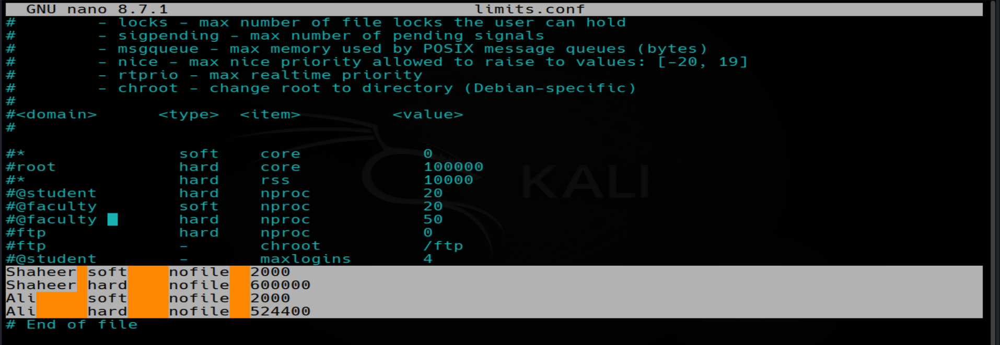

## Important parts of limits.conf

### Domain

The domain identifies who the rule applies to.

It can be:

`username`

A group can be specified with:

`@groupname`

A wildcard can be:

`*`

### Type

The type can be:

`soft`

or:

`hard`

Example:

```
Shaheer soft nofile 3000
Shaheer hard nofile 5000
```

### Item

The item specifies the resource.

Common limits.conf Items

| Item      | Meaning                       |
| --------- | ----------------------------- |
| `nofile`  | Maximum open file descriptors |
| `nproc`   | Maximum number of processes   |
| `fsize`   | Maximum file size             |
| `core`    | Maximum core dump size        |
| `stack`   | Maximum stack size            |
| `cpu`     | Maximum CPU time              |
| `memlock` | Maximum locked memory         |
| `as`      | Maximum address space         |

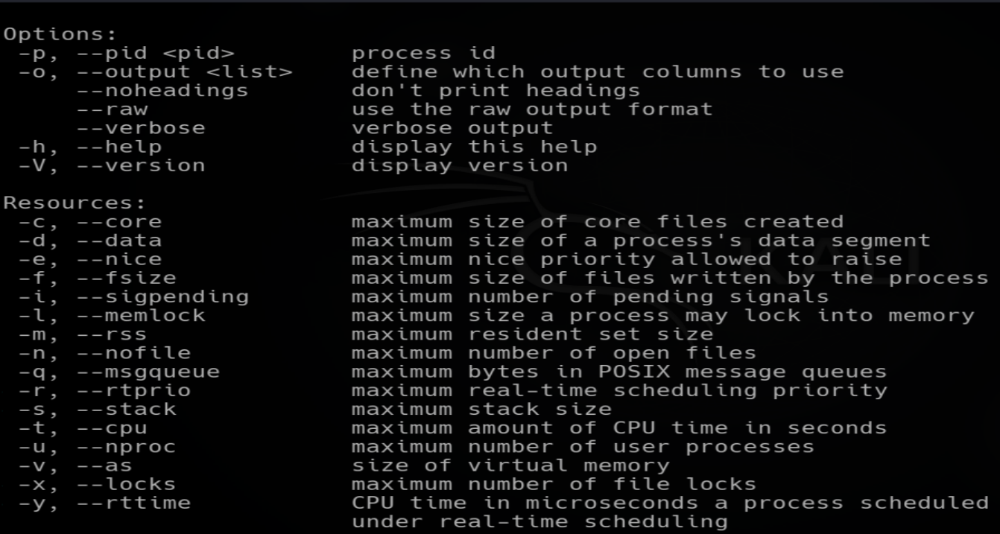

## Important Difference: User Limits vs System-Wide Limits

Do not confuse:

`ulimit / prlimit`

with:

`/proc/sys/fs/`

`ulimit` and `prlimit` deal with **per-process resource limits**.

`/proc/sys/fs/` contains **kernel/system-wide filesystem settings**.

For example:

```
/proc/sys/fs/file-max
/proc/sys/fs/nr_open
/proc/sys/fs/file-nr
```

are not simply the same thing as a process's `ulimit -n`.

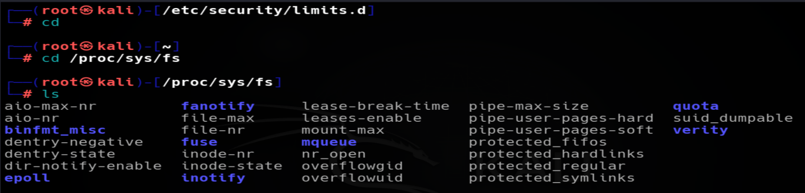

## fs.file-max

Check:

`cat /proc/sys/fs/file-max`

`file-max` is a system-wide kernel limit related to the maximum number of file handles that can be allocated system-wide.

It applies across the system rather than to one individual process.

Think:

```
file-max
    ↓
System-wide file-handle ceiling
```

## fs.nr_open

Check:

`cat /proc/sys/fs/nr_open`

`nr_open` is the system-wide ceiling for the maximum number of file descriptors that a **single process** can have.

Think:

```
nr_open
    ↓
Maximum possible NOFILE limit for one process
```

This is different from `file-max`.

## file-max vs nr_open

| Setting       | Scope                                        |
| ------------- | -------------------------------------------- |
| `fs.file-max` | System-wide maximum file handles             |
| `fs.nr_open`  | Maximum possible per-process open-file limit |

Example:

```text
file-max = system-wide ceiling
nr_open  = per-process ceiling
```

So if a process wants a very large `nofile` limit, `nr_open` is one of the kernel ceilings that matters.

## fs.file-nr

Check:

`cat /proc/sys/fs/file-nr`

The important note is:

> `file-nr` shows the current system-wide file-handle allocation information.

It should not be interpreted as simply "number of file descriptors currently open by all processes."

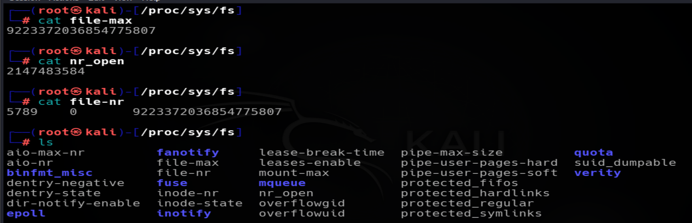

## Process File Descriptors vs System File Handles

These are related but not exactly the same thing.

A process has a file-descriptor table:

```
Process
   |
   ├── fd 0 → stdin
   ├── fd 1 → stdout
   ├── fd 2 → stderr
   └── fd 3 → file/socket/etc.
```

The kernel maintains system-wide file objects/handles behind these descriptors.

Therefore:

```
Process-level:
ulimit -n
/proc/PID/limits
```

and:

```
System-level:
fs.file-max
fs.file-nr
```

are different layers.

## Why `ulimit -n` Is Not `file-max`

Suppose:

`ulimit -n`

shows:

`1024`

This means:

> The current process has a soft limit of 1024 open file descriptors.

It does **not** mean the whole Linux system can only have 1024 open files.

The whole system can have many processes, each with their own file descriptors.

## Open File Descriptor vs File

This distinction is extremely important.

A **file** is stored by the filesystem.

A **file descriptor** is a small number used by a process to refer to an open file/socket/pipe/etc.

Example:

```
file1.txt
     ↑
filesystem object

fd 3
     ↑
process's reference to an open file
```

One file can be opened by multiple processes and therefore have multiple file descriptors.

## Inodes

An inode is a filesystem data structure containing metadata about a file or directory.

It can contain information such as:

* File type
* Permissions
* Owner
* Group
* File size
* Timestamps
* Links
* Pointers/references to file data blocks

The inode does **not** simply mean "physical memory address."

## Inode Number

Every inode is identified by an **inode number** within the filesystem.

You can see an inode number using:

`ls -li file.txt`

Example:

`1234 -rw-r--r-- 1 kali kali 500 Aug 10 file.txt`

Here:

`1234` is the inode number.


## Inode Number vs Physical Address

An inode number is **not a RAM address** and it is not a physical disk address.

Think of it as an identifier/index used by the filesystem to identify an inode.

The filesystem uses the inode structure to locate/manage the file's metadata and data references.

The hardware/storage layer handles the actual physical storage locations.

So:

```
Inode number
     ↓
Identifies inode
     ↓
Inode contains metadata + references to file data
     ↓
Filesystem/storage manages actual disk blocks
```

## `ls -li` and the Kernel

Suppose:

`ls -li abc.sh`

shows inode number:

`1234 -rw-r--r-- 1 kali kali 500 Aug 10 abc.sh`

When `abc.sh` is accessed, the kernel/filesystem uses the filesystem's inode information to identify and manage that file.

The inode number does not become a RAM address.

The kernel can also keep an **in-memory representation of the inode** while the file is being used.

## Disk Inode vs In-Memory Inode

It is useful to distinguish:

### Filesystem inode

The inode information maintained by the filesystem on storage.

### In-memory inode object

The kernel's in-memory representation of an inode while it is being actively used/cached.

They represent the same filesystem object, but they are not literally the same physical object.

Think:

```
Disk/filesystem
      |
      | inode information
      ↓
Kernel reads it
      |
      ↓
In-memory inode object
      |
      ↓
Kernel uses it
```

The inode number identifies the filesystem inode.

## `/proc/sys/fs/inode-nr`

Check:

`cat /proc/sys/fs/inode-nr`

Example:

`76012 525`

These values are **kernel inode accounting values**.

They should not be interpreted as:

```
76012 used inode numbers
+
525 free inode numbers
```

The values describe inode objects maintained by the kernel's inode cache/accounting system.

## `/proc/sys/fs/inode-state`

Check:

`cat /proc/sys/fs/inode-state`

Example:

```
76012 525 0 0 0 0 0
```

This provides more detailed inode-cache state information.

The important concept is:

> These values describe the kernel's in-memory inode/cache state, not the inode numbers printed by `ls -li`.

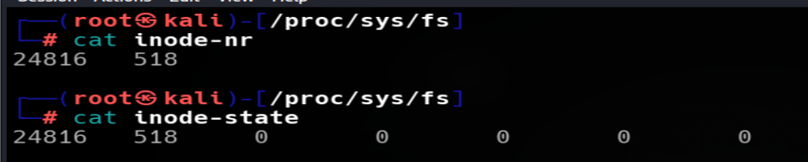

# 45. Important Inode Distinction

Do not confuse these three terms:

| Term                   | Meaning                                                |
| ---------------------- | ------------------------------------------------------ |
| Inode                  | Filesystem data structure containing file metadata     |
| Inode number           | Identifier used to identify an inode                   |
| In-memory inode object | Kernel's RAM-side representation of a filesystem inode |

A simple mental model:

```
Inode number
     ↓
Identifies
     ↓
Filesystem inode
     ↓
Metadata + data references

Kernel may keep
     ↓
In-memory inode object
```

## Important Commands for Inodes

Show inode number:

`ls -li file.txt`


Find filesystem type:

`df -T .`

View filesystem information with `debugfs` on ext filesystems:

`sudo debugfs /dev/sda1`

Inside `debugfs`, an inode can be inspected.

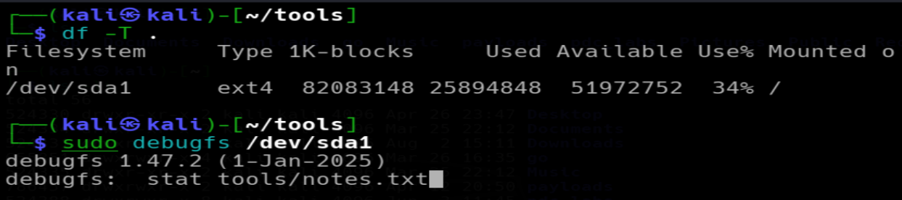
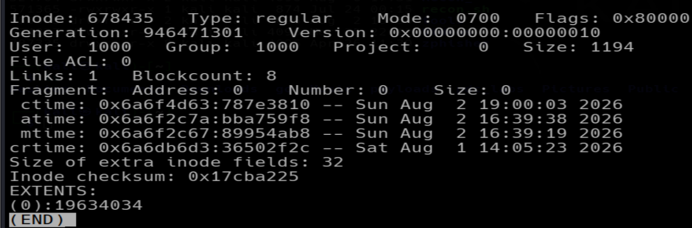


## Commands Discussed in This file

| Command                                  | Purpose                                 |
| ---------------------------------------- | --------------------------------------- |
| `ulimit -Sn`                             | Show soft open-file limit               |
| `ulimit -Hn`                             | Show hard open-file limit               |
| `ulimit -a`                              | Show current shell resource limits      |
| `ulimit -Sn 3000`                        | Change current shell's soft limit       |
| `ulimit -Hn 500000`                      | Change current shell's hard limit       |
| `type ulimit`                            | Confirm `ulimit` is a shell builtin     |
| `prlimit --pid PID`                      | Show limits of a process                |
| `prlimit --pid PID --nofile`             | Show NOFILE limit                       |
| `prlimit --pid PID --nofile=4000:500000` | Change process NOFILE limits            |
| `cat /proc/$$/limits`                    | Show current shell's limits             |
| `cat /proc/PID/limits`                   | Show a specific process's limits        |
| `cat /proc/sys/fs/file-max`              | Show system-wide file-handle ceiling    |
| `cat /proc/sys/fs/nr_open`               | Show maximum per-process NOFILE ceiling |
| `cat /proc/sys/fs/file-nr`               | Show system-wide file-handle accounting |
| `cat /proc/sys/fs/inode-nr`              | Show kernel inode accounting            |
| `cat /proc/sys/fs/inode-state`           | Show kernel inode-cache state           |
| `ls -li file.txt`                        | Show a file's inode number              |
