# LINUX SYSTEM MONITORING COMMANDS DOCUMENTATION
*Maintained by Muhammad Awais*

## Introduction
These commands are all about seeing what is actually happening inside a system right now, how much memory is free, how long it has been running, how busy the disk is, and how the CPU is spending its time. Nothing here changes anything on the system, they are all pure observation tools, which makes them safe to run anytime just to check on things.

### free
Shows how much RAM is currently being used, how much is free, and how much is being used for cache and buffers.

`free`

The numbers shown by default are in kilobytes, which can be a little hard to read at a glance.

`free -h`

Same command, but with human readable output, showing values in MB or GB instead of raw kilobytes, making it much easier to actually read.

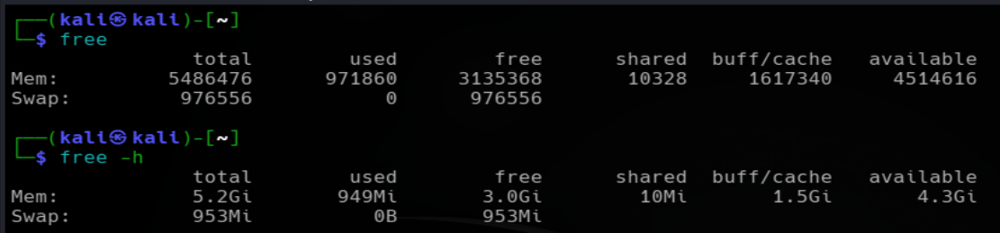

### uptime
Shows how long the system has been running since its last reboot, how many users are currently logged in, and the system load average over the last one, five, and fifteen minutes.

`uptime`

The load average numbers are worth understanding a little. They roughly represent how many processes were waiting for CPU time on average. A number close to or above the number of CPU cores on the machine usually means the system is under heavy load.

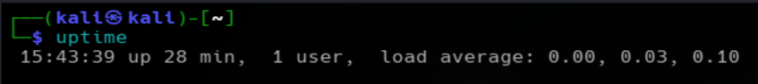

### iostat
Shows statistics about disk input and output, basically how busy the storage is, how much data is being read and written, and how much time the disk spends actually working versus sitting idle.

`iostat`

This is not installed by default on every system, it usually comes from a package called `sysstat`:

`sudo apt install sysstat`

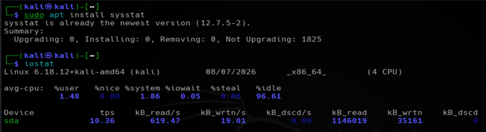

### vmstat
Short for virtual memory statistics, this shows a combined snapshot of processes, memory, paging activity, block I/O, and CPU usage, all in one single view.

`vmstat`

It can also run repeatedly at set intervals, which is useful for watching how things change over time instead of just seeing one single moment:

`vmstat 2 5`

This example refreshes every 2 seconds, for a total of 5 updates.

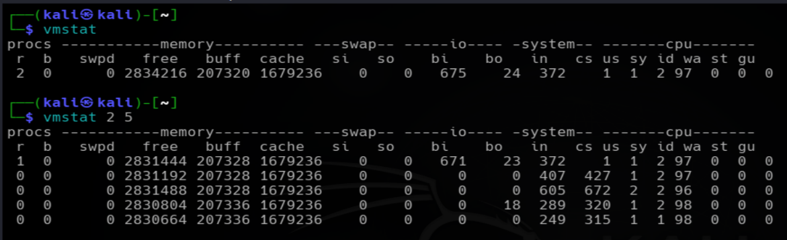

## sar
Short for system activity reporter, this is a more detailed, historical tool. Unlike the others which mostly show the current moment, `sar` can show performance data collected over time, assuming it has been logging in the background.

`sar`

To see CPU usage specifically:

`sar -u`

To see memory usage over time:

`sar -r`

Like `iostat`, this also comes from the `sysstat` package and needs to be installed and enabled to start collecting historical data:

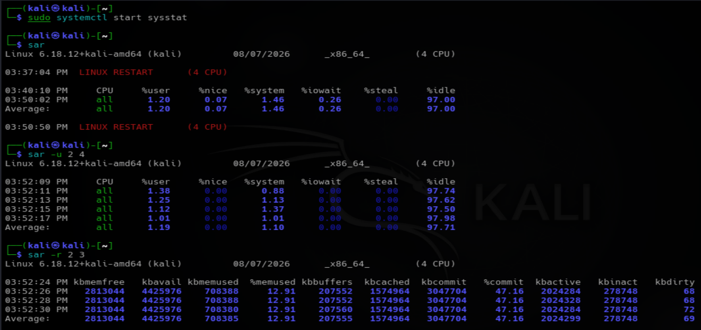

### df

Shows how much disk space is currently used and available on mounted filesystems. It shows the total filesystem size, used space, available space, and percentage of space being used.

`df`

The numbers shown by default are in 1K-blocks, which can be difficult to read directly.

`df -h`

Same command with human readable output, showing disk sizes in KB, MB, or GB instead of raw blocks.

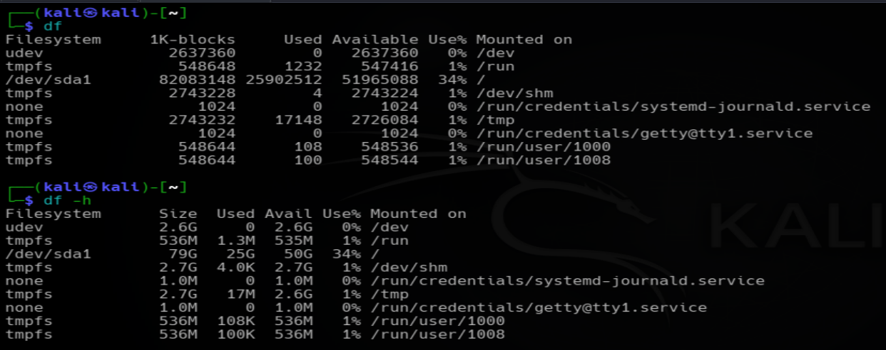

`df -T`

Shows the same filesystem disk-space information but also includes the filesystem type, such as `ext4`.

`df -T .`

Shows the filesystem type and disk-space information for the filesystem containing the current directory. The `.` means the current directory.

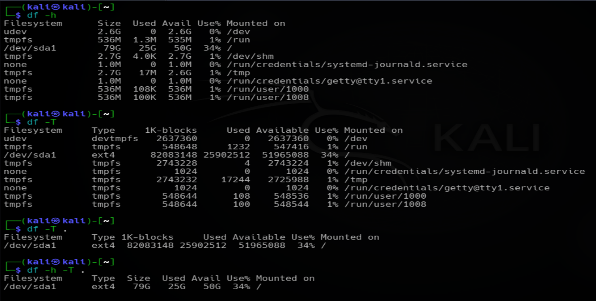

### du

Short for disk usage, this shows how much actual disk space files and directories are using. Unlike `df`, which reports filesystem-level usage, `du` can be used to find which directories or files are consuming space.

`du`

Shows the disk usage of directories under the current location. The default output is usually shown in kilobytes.

`du -h`

The `-h` will display the output in human readable form.

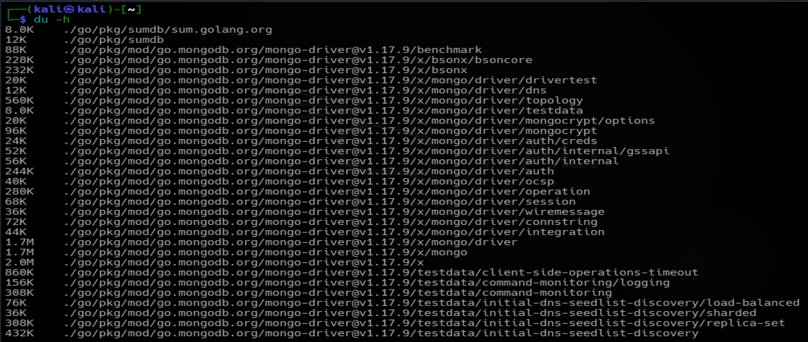

`du -sh`

Shows the total disk usage of the current directory in a human-readable format. The `-s` gives only the summary total instead of listing every subdirectory, while `-h` makes the size easier to read.

For example, to check the size of a specific directory:

`du -sh /<directory>`

This shows the total space being used by a specific directory in a human-readable format.

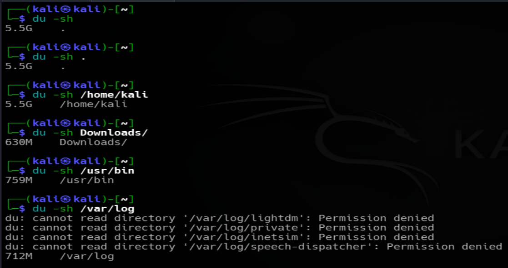

### watch

`watch` repeatedly runs a command at a fixed interval and continuously updates its output. It is useful for monitoring changing system information without manually running the same command again and again.

`watch command`

Runs the specified command repeatedly. By default, `watch` runs the command every 2 seconds.

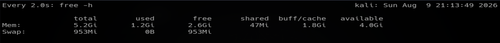

`watch -n 3 command`

The `-n` option specifies the update interval. This example runs the command every 3 seconds.

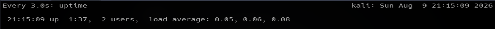

`watch -d command`

The `-d` option highlights the parts of the output that changed since the previous update.

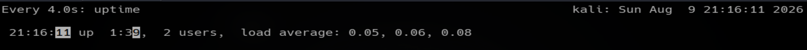

### watch command examples

To monitor disk space after every 3 seconds and see the highlighted changes:

`watch -d -n 3 df -h`

`-d` = highlights the parts of the output that changed since the previous interval.

`-n 3` = runs the command after every 3 seconds.

`df -h` = command

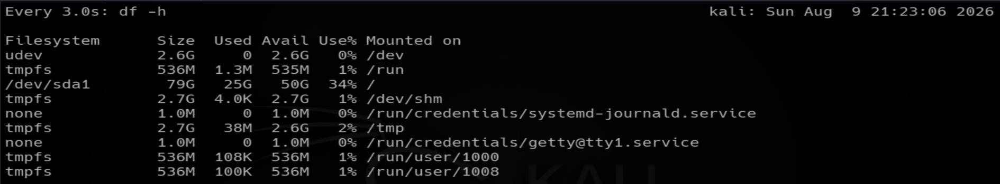

To monitor CPU activity:

`watch -d -n 3 top | head`

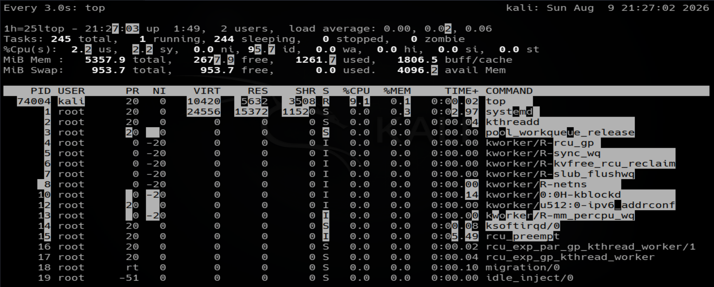

To repeatedly test network connectivity:

`watch -d -n 3 ping -c 3 google.com`

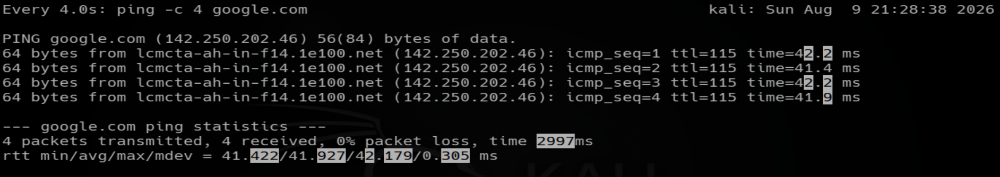

To monitor system uptime repeatedly after every 5 seconds:

`watch -d -n 5 uptime`

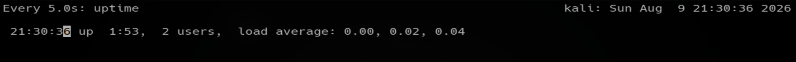

Press `Ctrl + C` to exit `watch`.

### Important options

| Option | Purpose                                        |
| ------ | ---------------------------------------------- |
| `-n`   | Sets how often the command is repeated         |
| `-d`   | Highlights changes between updates             |
| `-t`   | Removes the `watch` header                     |
| `-g`   | Exits when the command output changes          |
| `-e`   | Exits when the command returns an error status |
| `-b`   | Beeps when the command returns an error status |

### Commands discussed in this file for "system monitoring"

| Command  | Variants used                                  |
| -------- | ---------------------------------------------- |
| `free`   | `free`, `free -h`                              |
| `uptime` | `uptime`                                       |
| `iostat` | `iostat`                                       |
| `vmstat` | `vmstat`, `vmstat 2 5`                         |
| `sar`    | `sar`, `sar -u`, `sar -r`                      |
| `df`     | `df`, `df -h`, `df -T`, `df -T .`              |
| `du`     | `du`, `du -h`, `du -sh`, `du -sh /<directory>` |
| `watch`  | `watch`, `watch -n`, `watch -d`, `watch -d -n`, `watch -t`, `watch -g`, `watch -e`, `watch -b` |
